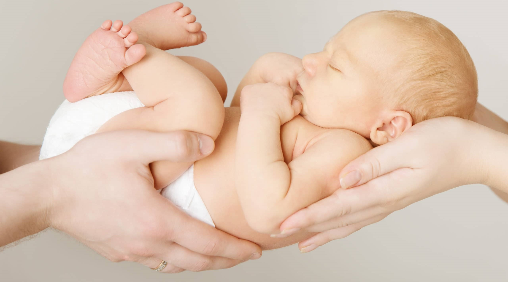
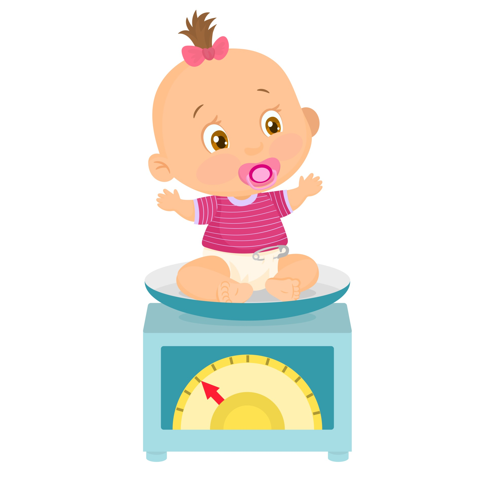

```{css, echo=FALSE}
.columns {display: flex; warning = FALSE}
h1{color: #36648B; warning = FALSE}
h2{color: #4682B4; warning = FALSE}
h3{color: #4F94CD; warning = FALSE}
h4{color: #63B8FF; warning = FALSE}
h5{color: #87CEEB; warning = FALSE}
```


# **Önsöz**

Bu çalışma, kaggle’dan alınan Pregnancy(*) adlı,  Kaiser Foundation Sağlık Planı'na kayıtlı olan ve San Francisco Doğu Körfez bölgesinde bulunan kadınların 1960 ile 1967 yılları arasındaki gebelikleri ile ilgili özellikleri incelemek amacıyla R programlama kullanılarak hazırlanmıştır. Veri seti 8 değişken ve 1236 gözlemden oluşmaktadır.

(*)  <https://www.kaggle.com/datasets/debjeetdas/babies-birth-weight>




# **Veri Tanımı**

Pregnancy veri setinde, Kaiser Foundation Sağlık Planı'na kayıtlı olan ve San Francisco Doğu Körfez bölgesinde bulunan kadınların 1960 ile 1967 yılları arasındaki gebelikleri yer almaktadır. 
The Child Health and Development Studies (Çocuk Sağlığı ve Gelişim Çalışmaları) kendini, sağlık ve hastalığın nesiller boyunca nasıl aktarıldığını araştırmaya adamıştır. Oakland, Kaliforniya'daki Kaiser Vakfı Sağlık Planına üye olan ailelerden 1959-1967 yılları arasında bir kadının hamile olduğunu anlayıp CHDS'ye gönüllü olması ile başlamıştır. 

CHDS, şimdi yetişkin olan CHDS çocukları ve onların çocukları (CHDS torunları) üzerinde yeni bir takip çalışmaları dönemi başlatmıştır. 

Gebelik süreci, anne ve bebeğin sağlığı açısından oldukça önemlidir. Bebeğin doğum ağırlığı; sağlıklı gebelik sürecinin bir göstergesi olup düşük doğum ağırlığı, bebeklerin sağlık sorunları ile karşılaşabileceği riskini arttırır. Bu nedenle, gebelik sürecini anlamak ve bebeğin doğum ağırlığını etkileyebilecek faktörleri incelemek mühimdir.
 

Veri setimizi import edelim.

```{r warning = FALSE}
pregnancy <- read.csv("PregnancyData.csv")
```


Veri setine göz atalım.

```{r warning = FALSE}
head(pregnancy)
```


## **Veri Seti Değişkenleri**

**•	case:** Kimlik numarasıdır. Sayısal bir değer olup Nominal türdedir.
Unique olarak adlandırılan eşsiz değerlerdir. Veri setinde sıra numarası şeklinde yer alıp herhangi bir bilgi kriteri taşımadığı için analize başlanmadan önce silinecektir. 

**•	bwt:** Doğum ağırlığı (ons), Ratio (Oransal) veri türündedir.
Uzmanlar tarafından yenidoğanların kilosu, 2.5 - 4.0 kg sınırları ile belirtilerek ortalama 3.2 kg olarak söylenmektedir. Ons cinsinden hesaplayacak olursak ağırlık aralığı 88.185-141.10 ons olmakla birlikte ortalama ağırlık ise 112.876 ons'a karşılık gelmektedir. Araştırma kapsamında, bebeklerin doğum ağırlığı 88-141 ons aralığında ise sağlıklı olarak kabul edilecektir.

**Bağımlı değişken olarak kullanılacaktır.**

**•	gestation:** Gebelik süresi (gün), Interval (Aralıklı) veri türüne aittir.
Sağlıklı bir gebelik 37-42 hafta (259-294 gün) arası sürer. 37 hafta (259 gün) öncesinde olan doğumlar; erken doğum, 42 hafta (294 gün) sonrasında gerçekleşen doğumlar ise geç doğum olarak adlandırılırlar.
Erken doğumun bazı nedenleri; daha önceden erken doğum yapmış olmak, gebelikte yeterince kilo alınmaması, gebelikte sigara içimidir. Ayrıca erken doğumlar, düşük doğum ağırlığına neden olabilirler. Geç doğumların ise yüksek oranda kesin bir nedeni yoktur. 

**•	parity:** İlk gebelik için ikili gösterge (0 = ilk gebelik), Nominal türdedir.
Annenin daha önce gebelik yaşayıp yaşamadığını ifade eder. Önceden gebelik yaşama; bazı metabolik/fizyolojik değişikliklere, yenidoğan bebeğinin kilosuna bile etki gösterebilir.

**•	age:** Annenin yaşı, Ordinaldir.
İdeal anne olma yaşı konusunda farklı görüşler ve tercihler vardır. Görüşlerin birleştirilmesi üzerine, analiz kapsamda ideal yaş aralığı 20-35 olarak alınacaktır.

**•	height:** Annenin boyu (inç), Ratio (Oransal) veri türündendir.

**•	weight:** Annenin ağırlığı (pound) ), Ratio (Oransal) veri türündendir.

height & weight: Annenin boyu ve kilosu hem genetik faktörler ile hem de büyüme/gelişme anlamında bebeğin ağırlığını etkileyebilir. Gebelik için ideal boy/kilo sınırı yoktur çünkü bu ölçüler kişiden kişiye farklılık gösterir. Ancak çalışma kapsamında, bu değişkenler için Vücut Kitle İndeksi hesaplanarak ideallik test edilecektir.

**•	smoke:** Annenin sigara içip içmediğine dair ikili gösterge, Nominaldir.
Sigara içmenin bilindiği üzere sağlığa, oldukça fazla zararı vardır. Gebelikte sigara kullanımı ise anneye zarar vermekle birlikte bebeğe de zarar verebilir. Özellikle erken doğum riski artabilir.




# **Problemin Tanımı ve Amaçlar**

Veri setinde bulunan bwt değişkeni, bebeklerin doğum ağırlıklarını ifade etmektedir. Araştırma kapsamında; bebeklerin doğum ağırlıklarına etki eden faktörler belirlenecektir. Ayrıca (eğer varsa) bebeklerin doğum ağırlığında etkili olan değişkenler, başka bebeklerin doğum ağırlıklarını tahmin etmek için de kullanılacaktır. 
Bebeklerin doğum ağırlıklarının tahmini ile; 
•	Bebeğin doğum ağırlığı hakkında daha önceden bilgi edinmek isteyen aileler veya sağlık uzmanlarına,
•	Sağlık politikalarının geliştirilmesi veya uygulanması için ilgili kurumlara (Örneğin; sigara kullanımını azaltmak veya obeziteyle mücadele etmek),
katkı sağlanmış olunacaktır.


# **Verilerin Yapısı ve Niteliği**

Veri setine göz attığımızda "case" değişkeninin unique olarak adlandırılan kimlik numarası olduğunu görmekteyiz. Analizimize herhangi bir katkı sağlamayacağı için o değişkeni veri setinden çıkarabiliriz.

```{r warning = FALSE}
pregnancy$case <- NULL
```


Analiz kapsamında, herhangi bir değişkenin %15'inden fazlası missing ise, o değişken silinecektir. Bu anlamda veri setinin toplam gözlem sayısına bakalım. Böylece değişkenlerin %15 ini hesaplayabiliriz. Ardından eksik gözlem durumunu kontrol edelim.

Az önce bulunduğu üzere, toplamda 1236 gözlem var. %15'ini hesaplayalım.

```{r warning = FALSE}
1236 * 0.15
```

185.4 değerini 185 olarak kabul edelim. Herhangi bir değişkenin 185 veya daha fazlası kadar eksik gözlemi var ise o değişkeni, veri setimizden çıkaralım.


## **Eksik Gözlem Kontrolü**


Eksik gözlemler bulunan satırları inceleyelim.

```{r warning = FALSE}
pregnancy[!complete.cases(pregnancy),]
```


Eksik gözlemleri kontrol edelim.

```{r warning = FALSE}
colSums(is.na(pregnancy))
```


Hiçbir değişkenimizin eksik gözlem sayısı 185'i aşmamaktadır. O halde herhangi bir değişkeni silmemize gerek kalmaz. Eksik değerler için değer ataması yapabiliriz.


### **Eksik Gözlemlerin Yapı İncelenmesi**


#### **FunModeling Paketi ile İnceleme**

```{r warning = FALSE}
library(funModeling)
df_status(pregnancy)
preg_na <- df_status(pregnancy)
preg_na[,c("variable","p_na")] 
```

Eksik gözlemlerin sayılarını bulmuştuk. Yukarıdaki tabloda da oranları yer almaktadır.
En çok eksik gözlemin weight ve height değişkenlerinde olduğunu görmekteyiz.

Hiçbir değişkenin eksik gözlem oranının %15'i aşmadığı buradan da görülmektedir.


#### **Mice Paketi ile İnceleme**


```{r warning = FALSE}
library(mice)
md.pattern(pregnancy)
```

bwt ve parity değişkenlerinde eksik gözlem olmadığını buradan da görmekteyiz.


#### **Oran ve Model ile İnceleme**

```{r warning = FALSE}
library(VIM)
library(ISLR)
aggr(pregnancy,col=c("steelblue1","violet"),numbers = TRUE, sortVars = TRUE, 
     labels = names(pregnancy),cex.axis = .7, gap = 7,
     ylab=c("Eksik Gözlem Oranları","Eksik Gözlem Modeli"))
```


Soldaki grafiğe baktığımızda, funModeling ile bulunan oranların grafiğini görürüz.
Sağdaki grafik de eksik gözlemlerin modellenmiş halidir.

Eksik gözlem sıraları büyükten küçüğe olacak şekilde;
weight - height - gestation - smoke - age değişkenlerindedir.


## **Eksik Gözlemleri Doldurma**

Eksik gözlemleri doldurmada **Karar Ağaçları** yöntemi tercih edilecektir.

Karar ağaçları, eksik gözlemleri doldurmak için veri setindeki diğer özelliklerden faydalanır. Bu sayede eksik gözlemler için daha güvenilir sonuçlar sağlanır.


Yapılan analizler ile bwt ve parity değişkenlerinde eksik gözlem olmadığı görülmektedir.
Yani eksik gözlem doldurma işlemi, diğer değişkenler için yapılacaktır.


### **Regresyon Yöntemi ile Eksik Gözlem Doldurma**

**gestation değişkeni**

Gestation değişkeni, sayısal olduğu için regresyon yöntemi tercih edilir.
Gestation değişkeni, bağımlı değişken gibi alınır. Diğer değişkenler sayesinde eksik gözlemler için en güvenilir sonuçlar bulunmaya çalışılır. 

```{r warning = FALSE}
library(Hmisc)
impute_arg <- aregImpute(gestation ~ bwt + parity + age + height + weight + smoke, data = pregnancy, n.impute = 1)

# Doldurulan gestation değerleri;
impute_arg$imputed$gestation 

new <- which(is.na(pregnancy$gestation))

# Atama işlemi;
pregnancy[new,]$gestation <- impute_arg$imputed$gestation  
```


**age değişkeni**

Age değişkeni, sayısal olduğu için regresyon yöntemi tercih edilir.
Age değişkeni, bağımlı değişken gibi alınır. Diğer değişkenler sayesinde eksik gözlemler için en güvenilir sonuçlar bulunmaya çalışılır. 


```{r warning = FALSE}
library(Hmisc)
impute_arg <- aregImpute(age ~ bwt + parity + gestation + height + weight + smoke, data = pregnancy, n.impute = 1)

# Doldurulan age değerleri;
impute_arg$imputed$age 

new2 <- which(is.na(pregnancy$age))

# Atama işlemi;
pregnancy[new2,]$age <- impute_arg$imputed$age  
```


**height değişkeni**

Height değişkeni, sayısal olduğu için regresyon yöntemi tercih edilir.
Height değişkeni, bağımlı değişken gibi alınır. Diğer değişkenler sayesinde eksik gözlemler için en güvenilir sonuçlar bulunmaya çalışılır. 


```{r warning = FALSE}
library(Hmisc)
impute_arg <- aregImpute(height ~ bwt + parity + gestation + age + weight + smoke, data = pregnancy, n.impute = 1)

# Doldurulan age değerleri;
impute_arg$imputed$height 

new3 <- which(is.na(pregnancy$height))

# Atama işlemi;
pregnancy[new3,]$height <- impute_arg$imputed$height  
```


**weight değişkeni**

Height değişkeni, sayısal olduğu için regresyon yöntemi tercih edilir.
Weight değişkeni, bağımlı değişken gibi alınır. Diğer değişkenler sayesinde eksik gözlemler için en güvenilir sonuçlar bulunmaya çalışılır. 


```{r warning = FALSE}
library(Hmisc)
impute_arg <- aregImpute(weight ~ bwt + parity + gestation + age + height + smoke, data = pregnancy, n.impute = 1)

# Doldurulan age değerleri;
impute_arg$imputed$weight 

new4 <- which(is.na(pregnancy$weight))

# Atama işlemi;
pregnancy[new4,]$weight <- impute_arg$imputed$weight  
```


### **Karar Ağaçları Yöntemi ile Eksik Gözlem Doldurma**

**smoke değişkeni**

Smoke değişkeni kategorik değişken olduğu için karar ağaçları kullanılır.
Smoke değişkeni, bağımlı değişken gibi alınır. Diğer değişkenler sayesinde eksik gözlemler için en güvenilir sonuçlar bulunmaya çalışılır. Değişken, kategorik olduğu için method olarak "class" tercih edilir.

Fakat bu işlemlerden önce ve sonra smoke değişkenini factor olarak tanımlamalıyız.


```{r warning = FALSE}
pregnancy$smoke <- factor(pregnancy$smoke, levels=c(0,1), labels=c("No", "Yes"))
library(rpart)
rtree <- rpart(smoke ~ bwt + parity + gestation + height + age + weight, pregnancy, method = "class")
library(rpart.plot)
rpart.plot(rtree, cex=0.5)
pregnancy$smoke <- ifelse(is.na(pregnancy$smoke), predict(rtree, pregnancy,type="class"), pregnancy$smoke)
pregnancy$smoke <- as.factor(pregnancy$smoke)
```


Veri setimizin ilk halinde sigara içmeyenler "0" , içenler ise "1" olarak kodlanmıştı.
Bu aşama ile eksik gözlemler dolduruldu ancak sigara içmeyenler "1" , içenler ise "2" olarak güncellendi.


Eksik gözlemlerin doldurulduğunu teyit edelim;

```{r warning = FALSE}
colSums(is.na(pregnancy))
```


Görüldüğü üzere veri setimizdeki eksik değerler doldurulmuştur.


## **Veri Kalitesi İncelemesi**

Bu başlık altında;
+ Değişkenler farklı ölçüm türlerinden tek bir türe çevrilecektir. Örneğin ağırlık için ons ve pound ölçümleri kullanılmıştır. Ağırlıklar kg cinsine, uzunluk ise cm cinsine çevrilecektir. 
+ Kategorik değişkenler etiketlenecektir. 
+ Ham veri için genel bir analiz yapılacaktır.


### **Değişkenlerin Çevrilmesi**

**bwt değişkeni**

bwt değişkeni ons cinsindendir. 1 ons yaklaşık 28.35 gram'a eşittir. Bu sebeple bwt değişkeni değerlerini öncelikle 28.35 ile çarparak gram değerlerini bulalım. Ardından 1000'e bölerek kg cinsinden yazalım.

```{r warning = FALSE}
pregnancy$bwt <- (pregnancy$bwt*28.35) / 1000
```


**height değişkeni**

height değişkeni inç cinsindendir. 1 inç 2.54 cm olduğu için height değerlerini 2.54 ile çarpıp cm cinsinden yazalım.

```{r warning = FALSE}
pregnancy$height <- pregnancy$height * 2.54
```


**weight değişkeni**

weight değişkeni pound cinsindendir. 1 pound 0.45 kg olduğu için weight değerlerini 0.45 ile çarpıp kg cinsinden yazalım.

```{r warning = FALSE}
pregnancy$weight <- pregnancy$weight * 0.45
```


### **Kategorik Değişkenleri Belirleme**

Veri setimizde yer alan parity ve smoke değişkenleri kategorik değişkenlerdir. Eksik gözlemleri doldururken smoke değişkenini factor olarak belirtmiştik. Şimdi bu işlemi parity için de yapalım.


```{r warning = FALSE}
pregnancy$parity <- factor(pregnancy$parity, levels=c(0,1), labels=c("No", "Yes"))
```


Eksik gözlemlerin doldurulması aşamasında smoke değişkeninin kategorileri 1 ve 2 olarak güncellenmişti. Değerlere etiketlerini atayalım.

```{r warning = FALSE}
pregnancy$smoke <- factor(pregnancy$smoke, levels=c(1,2), labels=c("No", "Yes"))
```


### **Betimsel İstatistikler**

Veri setinin genel özetine bakalım.

```{r warning = FALSE}
str(pregnancy)
```

1236 gözlem ve 7 değişken olduğunu görmekteyiz. 
parity ve smoke değişkenleri factor olup diğer değişkenler numeric türündedir.


Tüm nicel değişkenlerin histogramlarına ve boxplotlarına kısaca göz atalım.

```{r warning = FALSE}
plot_num(pregnancy)
```

Histogramlara göz atıldığında, normale en yakın dağılımın bwt ve height değişkenleri için olduğunu görmekteyiz. 
gestation ve weight değişkenlerinin sivri, age değişkeninin ise daha yaygın bir dağılımı var. Ayrıca yine age değişkeninde sağa çarpıklık söz konusu gibi duruyor.

Boxplotlara da bakacak olursak;


```{r warning = FALSE}
boxplot(pregnancy$bwt, pregnancy$gestation, pregnancy$age, pregnancy$height, pregnancy$weight, 
        main="Boxplots", names=c("bwt", "gestation", "age", "height", "weight"), col="orange")
```

Elbette tüm boxplotlara birden baktığımız için pek ayrıntılı sonuçlar görememekteyiz. Genel bir youm yapacak olursak, en çok uç değerin gestation ve weight değişkenlerinde olduğu görünmektedir.


Ancak yalnızca histogramlara veya boxplotlara bakarak yorum yapmak pek de doğru olmaz. Bu nedenle değişkenler tek tek, grafikleri ve istatistikleri ile incelenecektir.

Değişkenlerin genel özetlerine bakıp tek tek incelemeye geçelim.

```{r warning = FALSE}
sum_pregnancy <- summary(pregnancy)
```

Özet istatistikler, deüğişkene göre sırasıyla yorumlanacaktır.


#### **bwt değişkeni**

```{r warning = FALSE}
sum_pregnancy
```


bwt değişkeninin min değeri 1.559 ve max değeri 4.990 kg olarak bulunmuştur.

Uzmanlar tarafından yenidoğanların kilosu, 2.5 - 4.0 kg sınırları ile belirtilerek ortalama 3.2 kg olarak söylenmektedir. Max değer olan 4.990'a baktığımızda, sağlıklı kilo olarak kabul ettiğimiz 4 kg üst sınırın üstünde yer aldığını görmekteyiz. Minimum değer de, doktorların sağlıklı kabu ettiği alt sınırın oldukça altındadır.

Ortalama ve medyan değerleri birbirine yakın değerlerdir. Bu da bize, verinin ortalamaya yakın simetrisi olduğunu gösterebilir.

Çarpıklık ve basıklık değerlerini incelersek;

```{r warning = FALSE}
library(moments)
skewness(pregnancy$bwt)
kurtosis(pregnancy$bwt)
```

Çapıklık değeri -0.1406442 ve basıklık değeri 3.442576 olarak bulunmuştur. Bu da bize bwt değişkeni dağılımının sivri ve hafif sola çarpık olduğunu söyler.

Ancak emin olmak için histograma da bakalım.

```{r warning = FALSE}
hist(pregnancy$bwt, col = "cadetblue3", main = "Doğum Ağırlığı (kg) Histogramı")
```


Histograma bakınca, değişkenin gerçekten de normale yakın dağılımı olduğunu görmekteyiz.


Normallik varsayımını incelemek için QQ plot çizelim.


```{r warning = FALSE}
qqnorm(pregnancy$bwt, col = "darkblue", main = "Doğum Ağırlığı (kg) QQ Plot")
qqline(pregnancy$bwt, col = "red")
```

Q-Q Grafiğinden de değişkenin dağılımının normale oldukça yakın olduğunu görmekteyiz. Gözlemler eğriye oldukça yakınlar. Ancak baş ve uç kısımlarındaki değerlerin incelenmesi gerekmektedir.


```{r warning = FALSE}
library(funModeling)
profiling_num(pregnancy$bwt)
```

bwt değişkeninin ortalamasının yaklaşık 3.39, standart sapmasının yaklaşık 0.517 olduğunu görürüz. 
variation_coef, varyasyon katsayısıdır.  bir değişkenin ortalama değerine göre ne kadar değiştiğini gösterir. Daha spesifik olarak, varyasyon katsayısı, bir değişkenin ortalama değerine göre ne kadar değiştiğini gösterir. Standart sapmanın ortalamaya oranıdır. bwt değeri için bu değer yaklaşık 0.15'dir. 

Standart sapmanın yaklaşık olarak 0.517 olması, veri setindeki değerlerin ortalama değerden ne kadar sapma gösterdiği hakkında bilgi verir. Bu değer düşük bir standart sapma olarak yorumlanabilir ve veri setindeki değerlerin birbirine yakın olduğunu gösterir.

Varyasyon katsayısının yaklaşık olarak 0.15 olması, veri setindeki değişkenin dağılımının ortalama değere göre ne kadar değiştiğini ölçer. Bu değer düşük bir varyasyon katsayısı olarak yorumlanabilir ve değişkenin dağılımının stabil ve homojen olduğunu gösterir. Bu nedenle, veri setindeki değerlerin birbirine yakın olduğu sonucuna varılabilir.


p_01 = 2.022773 değeri bwt'nin %1'ine karşılık gelen değerdir.
p_05 = 3.08063 değeri bwt'nin %5'ine karşılık gelen değerdir.
p_25 = 3.083063 değeri bwt'nin %25'ine karşılık gelen değerdir. Yani 1. çeyrek değeridir.
p_50 = 3.402 değeri bwt'nin %50'sine karşılık gelen değerdir. Yani 2. çeyrek değer olup medyana eşittir.
p_75 = 3.71385 değeri bwt'nin %75'ine karşılık gelen değerdir. Yani 3. çeyrek değeridir.
p_95 = 4.22415 değeri bwt'nin %95'ine karşılık gelen değerdir.


```{r warning = FALSE}
boxplot(pregnancy$bwt , main = "Doğum Ağırlığı (kg) Boxplot", col = "orange")
```


Boxplot'u incelediğimizde bwt değişkeninin normale oldukça yakın bir dağılımının olduğunu görürüz. Medyan çizgisi, Q1 ve Q3 değerlerini ortalayan bir konumdadır. Ancak uç değerler vardır ve uç değerlerin dağılımı etkileyebileceği göz önünde bulundurulmalıdır.


#### **gestation değişkeni**

```{r warning = FALSE}
sum_pregnancy
```


gestation değişkeninin min değeri 148.0 ve max değeri 353.0 olarak bulunmuştur.

Uzmanlar tarafından sağlıklı bir gebelik süresinin 37-42 hafta (259-294 gün) arası sürmesi gerektiği söylenmektedir. 37 hafta (259 gün) öncesinde olan doğumlar; erken doğum, 42 hafta (294 gün) sonrasında gerçekleşen doğumlar ise geç doğum olarak adlandırılırlar.

Max değer olan 353'e baktığımızda, sağlıklı olarak kabul ettiğimiz 294 gün üst sınırın üstünde yer aldığını görmekteyiz. Ayrıca minimum değer olan 148 değeri de 259 alt sınırının oldukça altındadır.

Ortalama ve medyan değerleri birbirine yakın değerlerdir. Bu da bize, verinin ortalamaya yakın simetrisi olduğunu gösterebilir.

Çarpıklık ve basıklık değerlerini incelersek;

```{r warning = FALSE}
library(moments)
skewness(pregnancy$gestation)
kurtosis(pregnancy$gestation)
```

Çapıklık değeri -0.7784616 ve basıklık değeri 9.613986 olarak bulunmuştur. Bu da bize gestation değişkeni dağılımının sivri ve sola çarpık olduğunu söyler.


Ancak emin olmak için histograma da bakalım.

```{r warning = FALSE}
hist(pregnancy$gestation, col = "cadetblue3", main = "Gebelik Süresi (Gün) Histogramı")
```


Histogram, değişkenin oldukça sivri dağılımı olduğu izlenimini vermektedir. Ancak detaylı inceleme yapılmalıdır.


Normallik varsayımını incelemek için QQ plot çizelim.


```{r warning = FALSE}
qqnorm(pregnancy$gestation, col = "darkblue", main = "Gebelik Süresi (Gün) QQ Plot")
qqline(pregnancy$gestation, col = "red")
```


Q-Q Grafiği, dağılımın hafif kuyruklu olduğu izlenimini vermektedir. Doğrusal olmayan yapıdadır. Ayrıca uç değer kuşkusu da uyandırmaktadır.


```{r warning = FALSE}
library(funModeling)
profiling_num(pregnancy$gestation)
```

gestation değişkeninin ortalamasının yaklaşık 279.33, standart sapmasının yaklaşık 15.98 olduğunu görürüz. 
Varyasyon katsayısı yaklaşık 0.057'dir

Standart sapmanın yaklaşık olarak 15.98 olması, veri setindeki değerlerin ortalama değerden ne kadar sapma gösterdiği hakkında bilgi verir. Bu değer, ortalamaya bakılınca düşük bir standart sapma olarak yorumlanabilir ve veri setindeki değerlerin birbirine yakın olduğunu gösterir.

Varyasyon katsayısının yaklaşık olarak 0.057 olması, veri setindeki değişkenin dağılımının ortalama değere göre ne kadar değiştiğini ölçer. Bu değer düşük bir varyasyon katsayısı olarak yorumlanabilir ve değişkenin dağılımının stabil ve homojen olduğunu gösterir. Bu nedenle, veri setindeki değerlerin birbirine yakın olduğu sonucuna varılabilir.


p_01 = 233.35 değeri gestation'ın %1'ine karşılık gelen değerdir.
p_05 = 252 değeri gestation'ın %5'ine karşılık gelen değerdir.
p_25 = 272 değeri gestation'ın %25'ine karşılık gelen değerdir. Yani 1. çeyrek değeridir.
p_50 = 280 değeri gestation'ın %50'sine karşılık gelen değerdir. Yani 2. çeyrek değer olup medyana eşittir.
p_75 = 288 değeri gestation'ın %75'ine karşılık gelen değerdir. Yani 3. çeyrek değeridir.
p_95 = 302 değeri gestation'ın %95'ine karşılık gelen değerdir.


```{r warning = FALSE}
boxplot(pregnancy$gestation , main = "Gebelik Süresi (gün) Boxplot", col = "orange")
```


Boxplot'u incelediğimizde gestation değişkeninin normale oldukça yakın bir dağılımının olduğunu görürüz. Medyan çizgisi, Q1 ve Q3 değerlerini ortalayan bir konumdadır. Ancak oldukça fazla uç değer vardır ve uç değerlerin dağılımı etkileyebileceği göz önünde bulundurulmalıdır.


#### **parity değişkeni**

```{r warning = FALSE}
sum_pregnancy
```

parity değişkeni kategorik değişkendir. Annenin daha önce gebelik yaşayıp yaşamadığını ifade eder.

No: İlk gebelik
Yes: İlk gebelik değil, anlamına gelir.

Veri setindeki 921 kişinin ilk gebeliğinin bigileri yer alırken ilk gebeliği olmayan 315 kişi vardır. 

```{r warning = FALSE}
freq(pregnancy$parity)
```


İlk gebeliği olanlar veri setinin %75.51'ini oluşturuken ilk gebeliği olmayanlar %25.49'unu oluşturmaktadır.

#### **age değişkeni**

```{r warning = FALSE}
sum_pregnancy
```


age değişkeninin min değeri 15.00 ve max değeri 45.00 olarak bulunmuştur.

İdeal anne olma yaşı konusunda farklı görüşler ve tercihler vardır. Görüşlerin birleştirilmesi üzerine, analiz kapsamda ideal yaş aralığı 20-35 olarak alınacaktır.

Max değer olan 45'e baktığımızda, sağlıklı olarak kabul ettiğimiz 35 üst sınırın üstünde yer aldığını görmekteyiz. Ayrıca minimum değer olan 15 değeri de 20 alt sınırının altındadır.

Ortalama ve medyan değerleri birbirine yakın değerlerdir. Bu da bize, verinin ortalamaya yakın simetrisi olduğunu gösterebilir.

Çarpıklık ve basıklık değerlerini incelersek;

```{r warning = FALSE}
library(moments)
skewness(pregnancy$age)
kurtosis(pregnancy$age)
```

Çapıklık değeri 0.5823172 ve basıklık değeri 2.693305 olarak bulunmuştur. Bu da bize age değişkeni dağılımının basık ve hafif sağa çarpık olduğunu söyler.


Ancak emin olmak için histograma da bakalım.

```{r warning = FALSE}
hist(pregnancy$age, col = "cadetblue3", main = "Annelerin Yaşları Histogramı")
```


Histogram, değişkenin sağa çarpık dağılımı olduğunu göstermektedir. Ancak detaylı inceleme yapılmalıdır.


Normallik varsayımını incelemek için QQ plot çizelim.


```{r warning = FALSE}
qqnorm(pregnancy$age, col = "darkblue", main = "Annelerin Yaşları QQ Plot")
qqline(pregnancy$age, col = "red")
```


Q-Q Grafiğinde öncelikle gürültü göze çarpmaktadır. Bu gürültünün sebebi uç değerler olabilir. Dönüşüm uygulamasından sonra tekrar kontrol sağlanacaktır.


```{r warning = FALSE}
library(funModeling)
profiling_num(pregnancy$age)
```

age değişkeninin ortalamasının yaklaşık 27.26, standart sapmasının yaklaşık 5.78 olduğunu görürüz. 
Varyasyon katsayısı yaklaşık 0.212'dir

Standart sapmanın yaklaşık olarak 5.78 olması, veri setindeki değerlerin ortalama değerden ne kadar sapma gösterdiği hakkında bilgi verir. Bu değer, ortalamaya bakılınca düşük bir standart sapma olarak yorumlanabilir ve veri setindeki değerlerin birbirine yakın olduğunu gösterir. Ancak ilgili değişkenin yaş değişkeni olduğunu ve normal kabul ettiğimiz sınırları göz önünde bulundurursak çok da düşük bir standart sapma değildir.

Varyasyon katsayısının yaklaşık olarak 0.212 olması, veri setindeki değişkenin dağılımının ortalama değere göre ne kadar değiştiğini ölçer. Bu değer çok düşük olmayan (ancak yine de düşük) bir varyasyon katsayısı olarak yorumlanabilir ve değişkenin dağılımının homojene yakın olduğunu gösterir. 


p_01 = 18 değeri age'in %1'ine karşılık gelen değerdir.
p_05 = 19 değeri age'in %5'ine karşılık gelen değerdir.
p_25 = 23 değeri age'in %25'ine karşılık gelen değerdir. Yani 1. çeyrek değeridir.
p_50 = 26 değeri age'in %50'sine karşılık gelen değerdir. Yani 2. çeyrek değer olup medyana eşittir.
p_75 = 31 değeri age'in %75'ine karşılık gelen değerdir. Yani 3. çeyrek değeridir.
p_95 = 38 değeri age'in %95'ine karşılık gelen değerdir.


```{r warning = FALSE}
boxplot(pregnancy$age , main = "Annelerin Yaşları Boxplot", col = "orange")
```


Boxplot'u incelediğimizde age değişkeninin sağa çarpık dağılımının olduğunu görürüz. Ayrıca 2 tane de uç değer göze çarpmaktadır.


#### **height değişkeni**

```{r warning = FALSE}
sum_pregnancy
```


height değişkeninin min değeri 134.6 ve max değeri 182.9 olarak bulunmuştur.

Uzmanlar tarafından anneler için sağlıklı boy ve kilo tanısı net olarak yoktur. Bu sebeple height değişkeninden hareketle vücut kitle indeksi hesaplanıp yorumlacaktır.

Max değer 182.9 min değer 134.6'dır.

Ortalama ve medyan değerleri birbirine oldukça yakın değerlerdir. Bu da bize, verinin ortalamaya yakın simetrisi olduğunu gösterebilir.

Çarpıklık ve basıklık değerlerini incelersek;

```{r warning = FALSE}
library(moments)
skewness(pregnancy$height)
kurtosis(pregnancy$height)
```

Çapıklık değeri -0.08760216 ve basıklık değeri 3.172033 olarak bulunmuştur. Bu da bize height değişkeni dağılımının sivri ve hafif sola çarpık olduğunu söyler.


Ancak emin olmak için histograma da bakalım.

```{r warning = FALSE}
hist(pregnancy$height, col = "cadetblue3", main = "Annelerin Boyları (cm) Histogramı")
```


Histogram, değişkenin sivri ve hafif sola çarpık dağılımı olduğunu göstermektedir.


Normallik varsayımını incelemek için QQ plot çizelim.


```{r warning = FALSE}
qqnorm(pregnancy$height, col = "darkblue", main = "Annelerin Boyları (cm) QQ Plot")
qqline(pregnancy$height, col = "red")
```


Q-Q Grafiğinde öncelikle gürültü göze çarpmaktadır. Bu gürültünün sebebi uç değerler olabilir. Dönüşüm uygulamasından sonra tekrar kontrol sağlanacaktır.


```{r warning = FALSE}
library(funModeling)
profiling_num(pregnancy$height)
```

height değişkeninin ortalamasının yaklaşık 162.66, standart sapmasının yaklaşık 6.42 olduğunu görürüz. 
Varyasyon katsayısı yaklaşık 0.039'dur

Standart sapmanın yaklaşık olarak 16.42 olması, veri setindeki değerlerin ortalama değerden ne kadar sapma gösterdiği hakkında bilgi verir. Bu değer, ortalamaya bakılınca düşük bir standart sapma olarak yorumlanabilir ve veri setindeki değerlerin birbirine yakın olduğunu gösterir. Ancak ilgili değişkenin boy değişkeni olduğunu göz önünde bulundurursak çok da düşük bir standart sapma değildir.

Varyasyon katsayısının yaklaşık olarak 0.039 olması, veri setindeki değişkenin dağılımının ortalama değere göre ne kadar değiştiğini ölçer. Bu değer düşük bir varyasyon katsayısı olarak yorumlanabilir ve değişkenin dağılımının stabil ve homojen olduğunu gösterir. Bu nedenle, veri setindeki değerlerin birbirine yakın olduğu sonucuna varılabilir.


p_01 = 147.32	 değeri height'in %1'ine karşılık gelen değerdir.
p_05 = 152.4 değeri height'in %5'ine karşılık gelen değerdir.
p_25 = 157.48	 değeri height'in %25'ine karşılık gelen değerdir. Yani 1. çeyrek değeridir.
p_50 = 162.56	 değeri height'in %50'sine karşılık gelen değerdir. Yani 2. çeyrek değer olup medyana eşittir.
p_75 = 167.64 değeri height'in %75'ine karşılık gelen değerdir. Yani 3. çeyrek değeridir.
p_95 = 172.72 değeri height'in %95'ine karşılık gelen değerdir.


```{r warning = FALSE}
boxplot(pregnancy$height , main = "Annelerin Boyları (cm) Boxplot", col = "orange")
```


Boxplot'u incelediğimizde height değişkeninin normale oldukça yakın bir dağılımının olduğunu görürüz. Medyan çizgisi, Q1 ve Q3 değerlerini ortalayan bir konumdadır. Göze çarpan 2 tane de uç değer bulunmaktadır.


#### **weight değişkeni**

```{r warning = FALSE}
sum_pregnancy
```


weight değişkeninin min değeri 39.15 ve max değeri 112.50 olarak bulunmuştur.

Uzmanlar tarafından anneler için sağlıklı boy ve kilo tanısı net olarak yoktur. Bu sebeple weight değişkeninden hareketle vücut kitle indeksi hesaplanıp yorumlacaktır.

Max değer 112.50  min değer 39.15'dir.

Ortalama ve medyan değerleri birbirine oldukça yakın değerlerdir. Bu da bize, verinin ortalamaya yakın simetrisi olduğunu gösterebilir.

Çarpıklık ve basıklık değerlerini incelersek;

```{r warning = FALSE}
library(moments)
skewness(pregnancy$weight)
kurtosis(pregnancy$weight)
```

Çapıklık değeri 1.245007 ve basıklık değeri 5.77239 olarak bulunmuştur. Bu da bize weight değişkeni dağılımının sivri ve sağa çarpık olduğunu söyler.


Ancak emin olmak için histograma da bakalım.

```{r warning = FALSE}
hist(pregnancy$weight, col = "cadetblue3", main = "Annelerin Ağırlıkları (kg) Histogramı")
```


Histogram, değişkenin sivri ve sağa çarpık dağılımı olduğunu göstermektedir. 


Normallik varsayımını incelemek için QQ plot çizelim.


```{r warning = FALSE}
qqnorm(pregnancy$weight, col = "darkblue", main = "Annelerin Ağırlıkları (kg) QQ Plot")
qqline(pregnancy$weight, col = "red")
```


Q-Q Grafiği, dağılımın hafif kuyruklu olduğu izlenimini vermektedir. Ayrıca uç değer kuşkusu da uyandırmaktadır.


```{r warning = FALSE}
library(funModeling)
profiling_num(pregnancy$weight)
```

weight değişkeninin ortalamasının yaklaşık 57.89, standart sapmasının yaklaşık 9.48 olduğunu görürüz. 
Varyasyon katsayısı yaklaşık 0.16'dır.

Standart sapmanın yaklaşık olarak 9.48 olması, veri setindeki değerlerin ortalama değerden ne kadar sapma gösterdiği hakkında bilgi verir. Bu değer, ortalamaya bakılınca düşük bir standart sapma olarak yorumlanabilir ve veri setindeki değerlerin birbirine yakın olduğunu gösterir. Ancak ilgili değişkenin kilo değişkeni olduğunu göz önünde bulundurursak çok da düşük bir standart sapma değildir.

Varyasyon katsayısının yaklaşık olarak 0.16 olması, veri setindeki değişkenin dağılımının ortalama değere göre ne kadar değiştiğini ölçer. Bu değer düşük bir varyasyon katsayısı olarak yorumlanabilir ve değişkenin dağılımının stabil ve homojen olduğunu gösterir. Bu nedenle, veri setindeki değerlerin birbirine yakın olduğu sonucuna varılabilir.


p_01 = 42.0075 değeri weight'in %1'ine karşılık gelen değerdir.
p_05 = 45.45 değeri weight'in %5'ine karşılık gelen değerdir.
p_25 = 51.75 değeri weight'in %25'ine karşılık gelen değerdir. Yani 1. çeyrek değeridir.
p_50 = 56.25 değeri weight'in %50'sine karşılık gelen değerdir. Yani 2. çeyrek değer olup medyana eşittir.
p_75 = 62.6625 değeri weight'in %75'ine karşılık gelen değerdir. Yani 3. çeyrek değeridir.
p_95 = 76.5 değeri weight'in %95'ine karşılık gelen değerdir.


```{r warning = FALSE}
boxplot(pregnancy$weight , main = "Annelerin Ağırlıkları (kg) Boxplot", col = "orange")
```


Boxplot'u incelediğimizde height değişkeninin sağa çarpık olduğunu görürüz. Ayrıca oldukça fazla uç değer vardır.


#### **smoke değişkeni**

```{r warning = FALSE}
sum_pregnancy
```


smoke değişkeni kategorik değişkendir. Annenin daha önce gebelik yaşayıp yaşamadığını ifade eder.

Annenin sigara içip içmediğini ifade eder. Gebelikte sigara kullanımı ise anneye zarar vermekle birlikte bebeğe de zarar verebilir. Özellikle erken doğum riski artabilir.

No: Sigara içmiyor
Yes: Sigara içiyor, anlamına gelir.

Veri setindeki 751 kişinin sigara içmediğinin bigileri yer alırken sigara içen 485 kişi vardır. 

```{r warning = FALSE}
freq(pregnancy$smoke)
```


Sigara içmeyenler veri setinin %60.76'sını oluşturuken sigara içenler %39.24'ünü oluşturmaktadır.


# **Eğitim ve Test Veri Kümelerini Oluşturma**

Veri setinin %80'ini eğitim (train) ve %20'sini test olarak ayıralım.

Bağımlı değişkenimiz bwt (doğum ağırlıkları) olduğu için ilgili değişken olarak onu kullanacağız.

```{r warning = FALSE}
library(caret)
set.seed(74367432)
train_id <- createDataPartition(pregnancy$bwt, p=0.80,
                              list=FALSE,
                              times=1)
train <- pregnancy[train_id,]
test <- pregnancy[-train_id,]
```


Veri kümelerini R'dan Excel'e çevirelim.

```{r warning = FALSE}
library("openxlsx")
write.xlsx(train, 'train.xlsx')
write.xlsx(test, 'test.xlsx')
```


Eğitim aşamaları bitene dek train veri setini kullanacağız.


Ufak bir inceleme yapalım.

```{r warning = FALSE}
library(dplyr)
glimpse(train)
```


Eğitim veri setimiz 990 gözlem ve 7 değişkenden oluşmaktadır.


## **Yeni Kategorik Değişken Oluşturma**

gestation değişkeni, gün olarak gebelik süresini ifade eder. 
Sağlıklı bir gebelik 37-42 hafta (259-294 gün) arası sürer. 37 hafta (259 gün) öncesinde olan doğumlar; erken doğum, 42 hafta (294 gün) sonrasında gerçekleşen doğumlar ise geç doğum olarak adlandırılırlar.

gestation değişkenini kategorik değişkene çevirelim. 
+ 259-294 gün arasında doğanlara sağlıklı süre için "Healthy",
+ 259 gün öncesinde doğanlara erken doğum için "Early"
+ 294 gün sonrasında doğanlara ise geç doğum için "Late" yazalım.

```{r warning = FALSE}
train$gestation <- factor(ifelse(train$gestation < 259, "Early", 
                                      ifelse(train$gestation >= 259 & train$gestation <= 294, "Healthy",
                                      ifelse(train$gestation > 294, "Late", NA))), 
                                      levels = c("Healthy", "Late", "Early"),
                                      labels = c("Healthy", "Late", "Early"))

categories <- c("Early", "Healthy", "Late")
train$gestation <- factor(train$gestation, levels = categories)
```


# **Verilerin Açıklayıcı / Keşfedici Çözümlemesi**


## **Genel Özet İstatistikleri**

```{r warning = FALSE}
summary(train)
```

**bwt değişkeni**

Max değeri 4.990 min değeri 1.559 olarak bulunmuştur. Ortanca ve ortalama değerleri birbirlerine oldukça yakındır.
1. çeyrek değeri 3.069 ve 3. çeyrek değeri 3.714'tür. Q1,Q2 ve ortancayı yorumlarsak normale yakın olabileceği izlenimini alırız.


**gestation değişkeni**

gestation değişkeni nicel bir değişkendi ancak factore çevrildi. 77 doğumun erken doğum, 806 doğumun sağlıklı günler içinde, 107'sinin geç doğum olduğunu göstermektedir.


**parity değişkeni**

Annelerin 734'ünün ilk doğumunun 256'sının ise ilk doğumunun olmadığını göstermektedir.


**age değişkeni**

Max değeri 44.00 min değeri 15.00 olarak bulunmuştur. Ortanca ve ortalama değerleri birbirlerine oldukça yakındır.
1. çeyrek değeri 23.00 ve 3. çeyrek değeri 31.00'dir. Q1,Q2 ve ortancayı yorumlarsak değişkenin sola çarpık olabileceği izlenimini alırız.


**height değişkeni**

Max değeri 180.3 min değeri 134.6 olarak bulunmuştur. Ortanca ve ortalama değerleri birbirlerine eşittir.
1. çeyrek değeri 157.5 ve 3. çeyrek değeri 167.6'dır. Q1,Q2 ve ortancayı yorumlarsak normale oldukça yakın olabileceği izlenimini alırız.


**weight değişkeni**

Max değeri 112.50 min değeri 39.15 olarak bulunmuştur. Ortanca ve ortalama değerleri birbirlerine eşittir.
1. çeyrek değeri 51.30 ve 3. çeyrek değeri 62.10'dur. Q1,Q2 ve ortancayı yorumlarsak değişkenin sola çarpık olabileceği izlenimini alırız.


**smoke değişkeni**

Annelerin 591'inin sigara içmediğini, 399'unun ise sigara içtiğini gösterir.


## **Özet İstatistikleri**

### **Konum Ölçüleri**

#### **Nokta Özetleri**

##### **Üç Nokta Özeti**

**bwt değişkeni**

```{r warning = FALSE}
n <- nrow(train)
train_siralama <- train[order(train$bwt),] 

#n çift sayı olduğu için;
a <- (n/2)
b <- (n/2)+1
(train_siralama$bwt[a] + train_siralama$bwt[b])/2
median(train$bwt)
mean(train$bwt)
```

Ortanca > Ortalama olduğu için sola çarpıktır.

**age değişkeni**

```{r warning = FALSE}
n <- nrow(train)
train_siralama <- train[order(train$age),] 

#n çift sayı olduğu için;
a <- (n/2)
b <- (n/2)+1
(train_siralama$age[a] + train_siralama$age[b])/2
median(train$age)
mean(train$age)
```

Ortanca < Ortalama olduğu için sağa çarpıktır.


**height değişkeni**

```{r warning = FALSE}
n <- nrow(train)
train_siralama <- train[order(train$height),] 

#n çift sayı olduğu için;
a <- (n/2)
b <- (n/2)+1
(train_siralama$height[a] + train_siralama$height[b])/2
median(train$height)
mean(train$height)
```

Ortanca < Ortalama olduğu için sağa çarpıktır.


**weight değişkeni**

```{r warning = FALSE}
n <- nrow(train)
train_siralama <- train[order(train$weight),] 

#n çift sayı olduğu için;
a <- (n/2)
b <- (n/2)+1
(train_siralama$weight[a] + train_siralama$weight[b])/2
median(train$weight)
mean(train$weight)
```

Ortanca < Ortalama olduğu için sağa çarpıktır.


##### **Beş Nokta Özeti**

**bwt değişkeni**

```{r warning = FALSE}
fivenum(train$bwt)
```

En küçük değer; 1.55925
Q1; 3.06180 
Ortanca; 3.40200 
Q3; 3.71385 
En büyük değer; 4.98960 

**age değişkeni**

```{r warning = FALSE}
fivenum(train$age)
```

En küçük değer; 15
Q1; 23 
Ortanca; 26 
Q3; 31 
En büyük değer; 44 


**height değişkeni**

```{r warning = FALSE}
fivenum(train$height)
```

En küçük değer; 134.62 
Q1; 157.48  
Ortanca; 162.56  
Q3; 167.64  
En büyük değer; 180.34 


**weight değişkeni**

```{r warning = FALSE}
fivenum(train$weight)
```

En küçük değer; 39.15   
Q1; 51.30    
Ortanca; 56.25    
Q3; 62.10   
En büyük değer; 112.50 


#### **Ortancalar**

```{r warning = FALSE}
median(train$bwt)
median(train$age)
median(train$height)
median(train$weight)
```


Ortancalar;
bwt değişkeni için 3.402
age değişkeni için 26
height değişkeni için 162.56
weight değişkeni için 56.25 bulunmuştur.


#### **Aritmetik Ortalamalar**

```{r warning = FALSE}
mean(train$bwt)
mean(train$age)
mean(train$height)
mean(train$weight)
```


Ortalamalar;
bwt değişkeni için 3.392464
age değişkeni için 27.10909
height değişkeni için 162.6344
weight değişkeni için 57.81227 bulunmuştur.


#### **Geometrik Ortalamalar**

```{r warning = FALSE}
library(psych)
geometric.mean(train$bwt)
geometric.mean(train$age)
geometric.mean(train$height)
geometric.mean(train$weight)
```


Geometrik ortalamalar;
bwt değişkeni için 3.351785
age değişkeni için 26.52994
height değişkeni için 162.506
weight değişkeni için 57.11128 bulunmuştur.


#### **Kesilmiş Ortalamalar**

%15 oranı en sık kullanılan oran olduğu için biz de o oranda inceleme yapalım.

**bwt değişkeni**

```{r warning = FALSE}
point <- 0.15
mean(train$bwt, trim = point)

# Ham veri toplam gözlem sayısı;
n <- nrow(train)
n

# Kalan gözlem sayısı;
ks <-n-(as.integer(2*point*n)) 
ks
```

%15 kesilmiş ortalama alındığında 990 gözlemden 693 tanesi kalmaktadır.
Ortalama değere bakacak olursak, ham veride 3.392464 idi.
%15 kesilmiş halinde ise 3.398405 olarak bulunmuştur. Çok ufak bir azalma vardır.


**age değişkeni**

```{r warning = FALSE}
point <- 0.15
mean(train$age, trim = point)

# Ham veri toplam gözlem sayısı;
n <- nrow(train)
n

# Kalan gözlem sayısı;
ks <-n-(as.integer(2*point*n)) 
ks
```

%15 kesilmiş ortalama alındığında 990 gözlemden 693 tanesi kalmaktadır.
Ortalama değere bakacak olursak, ham veride 27.10909 idi.
%15 kesilmiş halinde ise 26.58501 olarak bulunmuştur. 0.52408 azalma vardır.


**height değişkeni**

```{r warning = FALSE}
point <- 0.15
mean(train$height, trim = point)

# Ham veri toplam gözlem sayısı;
n <- nrow(train)
n

# Kalan gözlem sayısı;
ks <-n-(as.integer(2*point*n)) 
ks
```

%15 kesilmiş ortalama alındığında 990 gözlemden 693 tanesi kalmaktadır.
Ortalama değere bakacak olursak, ham veride 162.6344 idi.
%15 kesilmiş halinde ise 162.6918 olarak bulunmuştur. Çok ufak bir artış vardır.


**weight değişkeni**

```{r warning = FALSE}
point <- 0.15
mean(train$weight, trim = point)

# Ham veri toplam gözlem sayısı;
n <- nrow(train)
n

# Kalan gözlem sayısı;
ks <-n-(as.integer(2*point*n)) 
ks
```

%15 kesilmiş ortalama alındığında 990 gözlemden 693 tanesi kalmaktadır.
Ortalama değere bakacak olursak, ham veride 57.81227 idi.
%15 kesilmiş halinde ise 56.75187 olarak bulunmuştur. Ufak bir azalma vardır.


### **Değişim Ölçüleri**

#### **Genişlik**

```{r warning = FALSE}
genislik_bwt <- max(train$bwt) - min(train$bwt)
genislik_age <- max(train$age) - min(train$age)
genislik_height <- max(train$height) - min(train$height)
genislik_weight <- max(train$weight) - min(train$weight)
```

```{r warning = FALSE}
genislik_bwt
genislik_age
genislik_height
genislik_weight
```


Genişlikler;
bwt değişkeni için 3.43035
age değişkeni için 29
height değişkeni için 45.72
weight değişkeni için 73.35 bulunmuştur.


#### **DAG**

**bwt değişkeni için**

```{r warning = FALSE}
q1 <- as.vector(quantile(train$bwt,0.25))
q3 <- as.vector(quantile(train$bwt,0.75))
DAG_bwt <- q3-q1
DAG_bwt
```

**age değişkeni için**

```{r warning = FALSE}
q1 <- as.vector(quantile(train$age,0.25))
q3 <- as.vector(quantile(train$age,0.75))
DAG_age <- q3-q1
DAG_age
```

**height değişkeni için**

```{r warning = FALSE}
q1 <- as.vector(quantile(train$height,0.25))
q3 <- as.vector(quantile(train$height,0.75))
DAG_height <- q3-q1
DAG_height
```


**weight değişkeni için**

```{r warning = FALSE}
q1 <- as.vector(quantile(train$weight,0.25))
q3 <- as.vector(quantile(train$weight,0.75))
DAG_weight <- q3-q1
DAG_weight
```


DAG değerleri;
bwt değişkeni için 0.6449625
age değişkeni için 8
height değişkeni için 10.16
weight değişkeni için 10.8 bulunmuştur.


#### **Varyans**

```{r warning = FALSE}
var(train$bwt)
var(train$age)
var(train$height)
var(train$weight)
```

Varyanslar;
bwt değişkeni için 0.2625117
age değişkeni için 32.62914
height değişkeni için 41.56781
weight değişkeni için 88.39662 bulunmuştur.


#### **Değişim Katsayıları**


```{r warning = FALSE}
(sd(train$bwt) / mean(train$bwt))*100
(sd(train$age) / mean(train$age))*100
(sd(train$height) / mean(train$height))*100
(sd(train$weight) / mean(train$weight))*100
```

Değişim katsayıları;
bwt değişkeni için 15.10286
age değişkeni için 21.07113
height değişkeni için 3.964297
weight değişkeni için 16.26289 bulunmuştur.


#### **MAD**

**bwt değişkeni için**

```{r warning = FALSE}
sort <- train[order(train$bwt),]
medianf <- median(sort$bwt)
sort$fmed <- abs(sort$bwt-medianf)
sort2 <- sort[order(sort$fmed),]
mad <- median(sort2$fmed)
mad

median(train$bwt)
mean(train$bwt)
```

Ortanca ve ortalama dahilinde mad değeri çok büyük bulunmamıştır. Bu da veri kümesindeki değerlerin ortalama çevresinde birbirine yakın 
kümelendiklerini gösterir.

**age değişkeni için**

```{r warning = FALSE}
sort <- train[order(train$age),]
medianf <- median(sort$age)
sort$fmed <- abs(sort$age-medianf)
sort2 <- sort[order(sort$fmed),]
mad <- median(sort2$fmed)
mad

median(train$age)
mean(train$age)
```

Ortanca ve ortalama dahilinde mad değeri küçük bulunmuştur. Bu da veri kümesindeki değerlerin ortalama çevresinde birbirine yakın 
kümelendiklerini gösterir.


**height değişkeni için**

```{r warning = FALSE}
sort <- train[order(train$height),]
medianf <- median(sort$height)
sort$fmed <- abs(sort$height-medianf)
sort2 <- sort[order(sort$fmed),]
mad <- median(sort2$fmed)
mad

median(train$height)
mean(train$height)
```

Ortanca ve ortalama dahilinde mad değeri küçük bulunmuştur. Bu da veri kümesindeki değerlerin ortalama çevresinde birbirine yakın 
kümelendiklerini gösterir.


**weight değişkeni için**

```{r warning = FALSE}
sort <- train[order(train$weight),]
medianf <- median(sort$weight)
sort$fmed <- abs(sort$weight-medianf)
sort2 <- sort[order(sort$fmed),]
mad <- median(sort2$fmed)
mad

median(train$weight)
mean(train$weight)
```

Ortanca ve ortalama dahilinde mad değeri küçük bulunmuştur. Bu da veri kümesindeki değerlerin ortalama çevresinde birbirine yakın 
kümelendiklerini gösterir.


#### **Gini İndeksi**

Gini, nitel verilerde değişkenliği ölçüsüdür.

**gestation değişkeni**

```{r warning = FALSE}
freq <- as.data.frame(table(train$gestation))
names(freq)[1] <- 'Gebelik Süresi'

gini <- function(a,b) {
  a1 <- (a/(a+b))**2
  b1 <- (b/(a+b))**2
  x<-1-(a1 + b1)
  return(x)
 warning = FALSE}
gn <- gini(freq[1,2],freq[2,2])
k <- 2
gn/((k-1)/k)

```

Gini indeksi 0.3112129 bulunmuştur. Bu değer 0'a daha yakın olduğu için değişkenin dağılımının homojene daha yakın olduğu söylenebilir.


**parity değişkeni**

```{r warning = FALSE}
freq <- as.data.frame(table(train$parity))
names(freq)[1] <- 'Gebelik Süresi'

gini <- function(a,b) {
  a1 <- (a/(a+b))**2
  b1 <- (b/(a+b))**2
  x<-1-(a1 + b1)
  return(x)
 warning = FALSE}
gn <- gini(freq[1,2],freq[2,2])
k <- 2
gn/((k-1)/k)

```

Gini indeksi 0.7668768 bulunmuştur. Bu değer 1'e oldukça yakın olduğu için değişkenin dağılımının heterojene yakın olduğu söylenebilir.


**smoke değişkeni**

```{r warning = FALSE}
freq <- as.data.frame(table(train$smoke))
names(freq)[1] <- 'Gebelik Süresi'

gini <- function(a,b) {
  a1 <- (a/(a+b))**2
  b1 <- (b/(a+b))**2
  x<-1-(a1 + b1)
  return(x)
 warning = FALSE}
gn <- gini(freq[1,2],freq[2,2])
k <- 2
gn/((k-1)/k)

```

Gini indeksi 0.9623875 bulunmuştur. Bu değer neredeyse 1'e eşit olduğu için değişkenin dağılımının heterojen olduğu söylenebilir.


#### **Entropi**

**Entropi**

Entropi, nitel verilerde değişkenliği ölçüsüdür.

**gestation değişkeni**

```{r warning = FALSE}
freq <- as.data.frame(table(train$gestation))
names(freq)[1] <- 'Gebelik Süresi'

entropi <- function(base,a,b) {
  var <-  abs(((a)/(a+b))*log(((a)/(a+b)),base))-(((b)/(a+b))*log(((b)/(a+b)),base))
  return(var)
 warning = FALSE}
ent <- entropi(10,freq[1,2],freq[2,2])
k <- 2
ent/(log(k,10)) 

```

Entropi 0.4196731 bulunmuştur. Bu değer biraz ortada. Ancak 0'a biraz daha yakın olduğu için değişkenin dağılımının homojene yakın olduğu söylenebilir.


**parity değişkeni**

```{r warning = FALSE}
freq <- as.data.frame(table(train$parity))
names(freq)[1] <- 'Gebelik Süresi'

entropi <- function(base,a,b) {
  var <-  abs(((a)/(a+b))*log(((a)/(a+b)),base))-(((b)/(a+b))*log(((b)/(a+b)),base))
  return(var)
 warning = FALSE}
ent <- entropi(10,freq[1,2],freq[2,2])
k <- 2
ent/(log(k,10)) 

```

Entropi 0.8246049 bulunmuştur. Bu değer  1'e çok yakın olduğu için değişkenin dağılımının heterojene yakın olduğu söylenebilir.


**smoke değişkeni**

```{r warning = FALSE}
freq <- as.data.frame(table(train$smoke))
names(freq)[1] <- 'Gebelik Süresi'

entropi <- function(base,a,b) {
  var <-  abs(((a)/(a+b))*log(((a)/(a+b)),base))-(((b)/(a+b))*log(((b)/(a+b)),base))
  return(var)
 warning = FALSE}
ent <- entropi(10,freq[1,2],freq[2,2])
k <- 2
ent/(log(k,10)) 

```

Entropi 0.9726956 bulunmuştur. Bu değer  1'e çok yakın olduğu için değişkenin dağılımının heterojene yakın olduğu söylenebilir.


### **Biçim Ölçüleri**
#### **Çarpıklık-Basıklık Katsayıları**


**bwt değişkeni**

```{r warning = FALSE}
library(moments)
skewness(train$bwt)
kurtosis(train$bwt)
```

Çapıklık değeri -0.1238406 ve basıklık değeri 3.501518 olarak bulunmuştur. Bu da bize bwt değişkeni dağılımının sivri ve hafif sola çarpık olduğunu söyler.


**age değişkeni**

```{r warning = FALSE}
library(moments)
skewness(train$age)
kurtosis(train$age)
```

Çapıklık değeri 0.5546203 ve basıklık değeri 2.662981 olarak bulunmuştur. Bu da bize age değişkeni dağılımının basık ve sağa çarpık olduğunu söyler.


**height değişkeni**

```{r warning = FALSE}
library(moments)
skewness(train$height)
kurtosis(train$height)
```

Çapıklık değeri -0.1304564 ve basıklık değeri 3.218946 olarak bulunmuştur. Bu da bize height değişkeni dağılımının sivri ve hafif sola çarpık olduğunu söyler.


**weight değişkeni**

```{r warning = FALSE}
library(moments)
skewness(train$weight)
kurtosis(train$weight)
```

Çapıklık değeri 1.219162 ve basıklık değeri 5.761421 olarak bulunmuştur. Bu da bize weight değişkeni dağılımının sivri ve sağa çarpık olduğunu söyler.


### **İlişki Ölçüleri**

#### **Kovaryans**

##### **Pearson İlişki (Korelasyon) Katsayısı**

Pearson ilişkisini yorumlamak için normallik gerekir.
Bu sebeple değişkenler arası pearson ilişki katsayısı şuan yorumlanmayacaktır.

##### **Kısmi ilişki katsayısı**

bwt, bağımlı değişken olmak üzere, diğer değişkenler kısmi ilişki katsayılarını hesaplayalım.

```{r warning = FALSE}
# Kısmi ilişki katsayıları
partial_cor_age <- summary(lm(bwt ~ age + height + weight, data = train))$coefficients["age", "Estimate"]
partial_cor_height <- summary(lm(bwt ~ age + height + weight, data = train))$coefficients["height", "Estimate"]
partial_cor_weight <- summary(lm(bwt ~ age + height + weight, data = train))$coefficients["weight", "Estimate"]

# Sonuçlar
partial_cor_age
partial_cor_height
partial_cor_weight
```

**Age:** Age değişkeninin bwt (birth weight) ile kısmi ilişkisi 0.002058186 olarak hesaplanmıştır. Bu değer çok düşük olduğundan, yaşın bwt üzerindeki etkisi çok zayıftır ve istatistiksel olarak anlamlı bir ilişki göstermemektedir.

**Height:** Height değişkeninin bwt ile kısmi ilişkisi 0.01263818 olarak hesaplanmıştır. Bu pozitif katsayı, boyun birth weight üzerinde hafif bir pozitif etkisi olduğunu göstermektedir. Ancak, bu etki çok küçüktür.

**Weight:** Weight değişkeninin bwt ile kısmi ilişkisi 0.004503554 olarak hesaplanmıştır. Bu değer de çok düşüktür, bu nedenle ağırlığın bwt üzerindeki etkisi çok zayıftır ve istatistiksel olarak anlamlı bir ilişki göstermemektedir.

Sonuç olarak, verilen kısmi ilişki katsayılarına göre, age, height ve weight değişkenleri arasında bwt ile güçlü bir ilişki olduğunu söylemek doğru değildir. İlişkiler çok zayıf veya hemen hemen yoktur.


##### **Spearman’ın ilişki katsayısı**

bwt, bağımlı değişken olmak üzere, diğer değişkenler ile spearman hesaplayalım.

**bwt ve age**

```{r warning = FALSE}
correlation <- cor(train$bwt, train$age, method = "spearman")
correlation
```
bwt ve age  değişkenleri arasında çok zayıf bir sıralama ilişkisi olduğu söylenebilir. İlişki  pozitif yönlüdür. Yani, bir değişkenin değeri artarken diğer değişkenin değeri de genellikle artma eğilimindedir.

**bwt ve height**

```{r warning = FALSE}
correlation <- cor(train$bwt, train$height, method = "spearman")
correlation
```

Değişkenler arasında pozitif yönlü bir sıralama ilişkisi olduğunu gösterir. Yani, bir değişkenin değeri artarken diğer değişkenin değeri de genellikle artma eğilimindedir.

Ancak, katsayının değeri 1'e çok yakın olmadığından ilişki çok güçlü değildir. Orta düzeyde bir ilişki olduğunu söyleyebiliriz.


**bwt ve weight**

```{r warning = FALSE}
correlation <- cor(train$bwt, train$weight, method = "spearman")
correlation
```
Değişkenler arasında pozitif yönlü bir sıralama ilişkisi olduğunu gösterir. Yani, bir değişkenin değeri artarken diğer değişkenin değeri de genellikle artma eğilimindedir.

Ancak, katsayının değeri 1'e çok yakın olmadığından ilişki çok güçlü değildir. Orta düzeyde bir ilişki olduğunu söyleyebiliriz.


## **Histogram Grafikleri**


**bwt değişkeni**

Ancak emin olmak için histograma da bakalım.


```{r warning = FALSE}
k <- ceiling((log(2 * nrow(train))) + 1)
genislik <- max(train$bwt) - min(train$bwt)
binw <- genislik / k

ggplot(train, aes(bwt)) +
  geom_histogram(binwidth = binw, fill = "cadetblue3", colour = "black", alpha = 0.6) +
  ggtitle("Doğum Ağırlığı (kg) Histogramı")

```


Histograma bakınca, değişkenin gerçekten de normale yakın dağılımı olduğunu görmekteyiz.


**age değişkeni**

```{r warning = FALSE}
k <- ceiling((log(2 * nrow(train))) + 1)
genislik <- max(train$age) - min(train$age)
binw <- genislik / k

ggplot(train, aes(age)) +
  geom_histogram(binwidth = binw, fill = "darkorchid1", colour = "black", alpha = 0.6) +
  ggtitle("Annelerin Yaşları Histogramı")
```


Histogram, değişkenin hafif basık ve sağa çarpık dağılımı olduğunu göstermektedir. 


**height değişkeni**


```{r warning = FALSE}
k <- ceiling((log(2 * nrow(train))) + 1)
genislik <- max(train$height) - min(train$height)
binw <- genislik / k

ggplot(train, aes(height)) +
  geom_histogram(binwidth = binw, fill = "seagreen4", colour = "black", alpha = 0.6) +
  ggtitle("Annelerin Boyları (cm) Histogramı")
```


Histogram, değişkenin sivri ve hafif sola çarpık dağılımı olduğunu göstermektedir.


**weight değişkeni**

```{r warning = FALSE}
k <- ceiling((log(2 * nrow(train))) + 1)
genislik <- max(train$weight) - min(train$weight)
binw <- genislik / k

ggplot(train, aes(weight)) +
  geom_histogram(binwidth = binw, fill = "dodgerblue4", colour = "black", alpha = 0.6) +
  ggtitle("Annelerin Ağırlıkları (kg) Histogramı")

```


Histogram, değişkenin sivri ve sağa çarpık dağılımı olduğunu göstermektedir. 


### **Kategorik Değişken Düzeylerinde Histogram Grafikleri**

Bu grafik için 3 değişkeni olan gestation kategorik değişkenini seçelim.

**gestation ve bwt**

bwt değişkeni, bebeklerin doğum ağırlıklarını kg cinsinden ifade eden değişkendi. 

```{r warning = FALSE}
ggplot(train,aes(bwt,fill=gestation))+
  geom_histogram(binwidth=binw)+
  facet_grid(gestation~.)+
  scale_fill_manual(values=c("lightgreen","steelblue1","mediumorchid1"))

```

bwt değişkeni bebeklerin doğum kilolarını ifade etmekteydi. 

Sağlıklı sürede doğan bebeklerin kilolarının ağırlıklı olarak 5'ten az olduğu görünmektedir. 

Geç doğan bebeklerin kilolarının da ağırlıklı olarak 5'ten az olduğu görünmektedir. 

Sağlıklı sürede ve geç doğan bebeklerde kilosu 5'ten fazla olan bebek bulunsa da erken soğan bebeklerde bulunmamaktadır. Zaten erken doğumda bebeğin 5 kilodan fazla doğması oldukça zor bir orandır.


**gestation ve age**

```{r warning = FALSE}
ggplot(train,aes(age,fill=gestation))+
  geom_histogram(binwidth=binw)+
  facet_grid(gestation~.)+
  scale_fill_manual(values=c("lightgreen","steelblue1","mediumorchid1"))

```

Sağlıklı sürede doğan bebeklerin anneleri çoğunlukla 20-30 yaş aralığında yer almaktadır. Annelerin yaşları en başta sağlıklı kabul ettiğimiz yaşlardan az veya fazla olsa da sağlıklı sürede doğum gerçekleştiği görünmektedir.

Diğer grafikleri kontrol ettiğimizde geç ve erken doğumlar da 20-30 yaş aralığında fazladır.


**gestation ve height**

```{r warning = FALSE}
ggplot(train,aes(height,fill=gestation))+
  geom_histogram(binwidth=binw)+
  facet_grid(gestation~.)+
  scale_fill_manual(values=c("lightgreen","steelblue1","mediumorchid1"))

```

Sağlıklı sürede doğan bebeklerin anneleri boyları yaklaşık 158-168 cm aralığında yer almaktadır. Diğer grafikleri kontrol ettiğimizde geç ve erken doğumlar da en çok bu aralıkta yer almaktadır.


**gestation ve weight**

```{r warning = FALSE}
ggplot(train,aes(weight,fill=gestation))+
  geom_histogram(binwidth=binw)+
  facet_grid(gestation~.)+
  scale_fill_manual(values=c("lightgreen","steelblue1","mediumorchid1"))

```

Annelerin kilolarının yorumu da hemen hemen diğer grafik yorumlarına benzer. Ancak burada dikkat etmemiz gereken bir nokta var. 

Annelerin kiloları 100'ün üstüne çıksa bile sağlıklı sürede doğum gerçekleşmiştir. Geç ve erken doğumlar için bu görülmemektedir.


## **Yoğunluk Grafikleri**

**bwt değişkeni**

```{r warning = FALSE}
ggplot(train,aes(bwt))+
  geom_density()+
  geom_density(alpha=.4,fill="turquoise")
```

Bebeklerin kilolarına baktığımızda 3-4 kg aralığında yoğunlaştığını görmekteyiz.


**age değişkeni**

```{r warning = FALSE}
ggplot(train,aes(age))+
  geom_density()+
  geom_density(alpha=.4,fill="yellow")
```


Annelerin yaşları 20-30 aralığında yoğunlaşmaktadır. 


**height değişkeni**

```{r warning = FALSE}
ggplot(train,aes(height))+
  geom_density()+
  geom_density(alpha=.4,fill="springgreen")
```

Annelerin boyları 155-170 cm aralığında yoğunlaşmaktadır. Sola çarpıklık söz konusudur. Boyu 140 cm'den kısa anneler bunun sebebidir.

**weight değişkeni**

```{r warning = FALSE}
ggplot(train,aes(weight))+
  geom_density()+
  geom_density(alpha=.4,fill="slateblue3")
```


Annelerin kiloları 45-65 kg aralığında yoğunlaşmaktadır. Oldukça sağa çarpık bir dağılım vardır. Bu da bizlere, fazla kilosu olan annelerin bulunduğunu göstermektedir.


## **Histogram ve Yoğunluk Grafikleri**

**bwt değişkeni**

```{r warning = FALSE}
ggplot(train,aes(bwt))+
  geom_histogram(aes(y=..density..), fill="white", color="black")+
  geom_density(alpha=.4,fill="turquoise")
```

Dağılımın sivri ancak normale yakın olduğu görünmektedir.


**age değişkeni**

```{r warning = FALSE}
ggplot(train,aes(age))+
  geom_histogram(aes(y=..density..), fill="white", color="black")+
  geom_density(alpha=.4,fill="yellow")
```


Dağılım sivri ve sağa çarpıktır.


**height değişkeni**

```{r warning = FALSE}
ggplot(train,aes(height))+
  geom_histogram(aes(y=..density..), fill="white", color="black")+
  geom_density(alpha=.4,fill="springgreen")
```

Dağılım oldukça sivridir ve sola çarpıktır. Boyu 1410 cm'den kısa anneler bunun sebebidir.

**weight değişkeni**

```{r warning = FALSE}
ggplot(train,aes(weight))+
  geom_histogram(aes(y=..density..), fill="white", color="black")+
  geom_density(alpha=.4,fill="slateblue3")
```


Sivri ve oldukça sağa çarpık bir dağılım vardır. Bu da bizlere, fazla kilosu olan annelerin bulunduğunu göstermektedir.


## **Box Plots**


**bwt değişkeni**

```{r warning = FALSE}
ggplot(train, aes(y = bwt)) +
  geom_boxplot(fill = "aquamarine") +
  ggtitle("Doğum Ağırlığı (kg) Boxplot")
```


Grafiğe bakınca oldukça fazla uç değer olduğunu görmekte birlikte normale oldukça yakın olduğu yorumunu yapabiliriz. Ortancanın konumunu Q1 ve Q2'ye göre yorumlarsak neredeyse ortada görünmektedir. Bunun sebebi uç değerlerin her iki uçta da yer aldığından kaynaklanabilir. Ancak dönüşüm aşamasından sonra tekrar incelenecektir.


**age değişkeni**


```{r warning = FALSE}
ggplot(train, aes(y = age)) +
  geom_boxplot(fill = "violet") +
  ggtitle("Annelerin Yaşları Boxplot")
```


Dağılımın sağa çarpık olduğu box plot'tan da anlaşılmaktadır. Görünen yalnızca 1 adet uç değer bulunmaktadır.


**height değişkeni**


```{r warning = FALSE}
ggplot(train, aes(y = height)) +
  geom_boxplot(fill = "orangered") +
  ggtitle("Annelerin Boyları (cm) Boxplot")
```

Dağılım, normale oldukça yakındır. Ancak görünen 2 adet uç değer bulunmaktadır.


**weight değişkeni**


```{r warning = FALSE}
ggplot(train, aes(y = weight)) +
  geom_boxplot(fill = "mediumslateblue") +
  ggtitle("Annelerin Ağırlıkları (kg) Boxplot")
```

Dağılım normale yakın görünmekle birlikte oldukça fazla uç değer içermektedir.


### **Kategorik Değişken Düzeylerinde Box Plots**


Bu grafik için 3 değişkeni olan gestation kategorik değişkenini seçelim.

**gestation ve bwt**

bwt değişkeni, bebeklerin doğum ağırlıklarını kg cinsinden ifade eden değişkendi. 

```{r warning = FALSE}
ggplot(train, aes(x=gestation,y=bwt, fill=gestation))+
  geom_boxplot()+
  labs(title="Doğum Ağırlıkları İçin gestation Kutu Çizimi",
       x="gestation Kategorileri", y = "Doğum Ağırlıkları")+
  scale_fill_discrete(name = "gestation Kategorileri")+
  stat_summary(fun = median, geom="line", group= 1, color= "black", size = 1) 
```


Doğum ağırlıklarına ve gestation kategorilerine bakalım. gestation kategorileri early, healhty ve late idi. Bunlar bebeklerin anne karnında kaldıkları süreyi temsil ediyor. Yani aslında kendi içlerinde sıralılar.

Doğum ağırlığı arttıkça, bebeklerin anne karnında kalma süresini temsil eden değişkende de artış olduğunu görmekteyiz. Bu da aralarında ilişki olduğunu gösterir.


**gestation ve age**


```{r warning = FALSE}
ggplot(train, aes(x=gestation,y=age, fill=gestation))+
  geom_boxplot()+
  labs(title="Annelerin Yaşları İçin gestation Kutu Çizimi",
       x="gestation Kategorileri", y = "Annelerin Yaşları")+
  scale_fill_discrete(name = "gestation Kategorileri")+
  stat_summary(fun = median, geom="line", group= 1, color= "black", size = 1) 
```

Early'den Healthy'ye geçerken azalma olduğunu görmekteyiz.
Yani, gestation kategorisi Early'den Healthy'ye arttıkça, annelerin yaşı azalmaktadır. Ancak Healthy'den Late kategorisine geçerken düz bir şekilde devam etmektedir. Bu da o kısımda ilişki olmadığını gösterir.


**gestation ve height**


```{r warning = FALSE}
ggplot(train, aes(x=gestation,y=height, fill=gestation))+
  geom_boxplot()+
  labs(title="Annelerin Boyları İçin gestation Kutu Çizimi",
       x="gestation Kategorileri", y = "Annelerin Boyları")+
  scale_fill_discrete(name = "gestation Kategorileri")+
  stat_summary(fun = median, geom="line", group= 1, color= "black", size = 1) 
```

Çizginin tüm kategorilerde düz devam ettiğini görmekteyiz. Bu da bize, annelerin boyları ile bebeklerin anne karnında kalma süreleri arasında ilişki olmadığını göstermektedir.


**gestation ve weight**


```{r warning = FALSE}
ggplot(train, aes(x=gestation,y=weight, fill=gestation))+
  geom_boxplot()+
  labs(title="Annelerin Ağırlıkları İçin gestation Kutu Çizimi",
       x="gestation Kategorileri", y = "Annelerin Ağırlıkları")+
  scale_fill_discrete(name = "gestation Kategorileri")+
  stat_summary(fun = median, geom="line", group= 1, color= "black", size = 1) 
```

Early'den Healthy'ye geçerken azalış, Healthy'den Late'e geçerken artış görünmektedir. Annelerin ağırlıkları ile bebeklerin anne karnında kalma süreleri arasında ilişki vardır.


### **Kategorik Değişken Düzeylerinde Box Plots (Kantiller ile)**

Bu grafik için 3 değişkeni olan gestation kategorik değişkenini seçelim.

**gestation ve bwt**

```{r warning = FALSE}
ggplot(train, aes(x=gestation,y=bwt, fill=gestation)) +
  geom_boxplot(width=0.3)+
  stat_summary(fun.y = median, geom="line", group= 1, color= "blue", size = 1)+
  stat_summary(geom = 'line', linetype = "dashed",group=1,size = 1,fun.y = quantile, fun.args = list(probs = 0.25), position = position_dodge(0.75)) + 
  stat_summary(geom = 'line', group= 1,linetype = "dashed",size = 1, fun.y = quantile, fun.args = list(probs = 0.75), position = position_dodge(0.75)) 
```

Bebeklerin doğum ağırlıkları ile anne karnında kalma süreleri arasında ilişki bulunduğunu buradan da görmekteyiz. Q1 ve Q3 değerlerine bakıldığında onlarda da artış görünmektedir.

Erken doğumdan sağlıklı doğuma geçişi incelediğimizde; Q1'in Q3'e göre daha fazla arttığını gözlemlemekteyiz. Bu da bize, erken doğumdan sağlıklı doğuma geçerken 1. çeyreğin hızla arttığını göstermektedir. Bu da sağlıklı vakitte doğan bebeklerin ağırlıklarının, erken doğanlara göre (Q1 değerlerinin) hızla arttığını gösterir.

**gestation ve age**

```{r warning = FALSE}
ggplot(train, aes(x=gestation,y=age, fill=gestation)) +
  geom_boxplot(width=0.3)+
  stat_summary(fun.y = median, geom="line", group= 1, color= "blue", size = 1)+
  stat_summary(geom = 'line', linetype = "dashed",group=1,size = 1,fun.y = quantile, fun.args = list(probs = 0.25), position = position_dodge(0.75)) + 
  stat_summary(geom = 'line', group= 1,linetype = "dashed",size = 1, fun.y = quantile, fun.args = list(probs = 0.75), position = position_dodge(0.75)) 
```

Ortancalı boxplot yorumunda; erken doğum ile sağlıklı doğum arasında, az da olsa annelerin yaşları ile ilişki olduğunu ancak sağlıklı doğum ile geç doğum arasında olmadığını söylemiştik.

Q1 değerlerine bakarsak, erken doğumdan sağlıklı doğuma ve sağlıklı doğumdan geç doğuma geçerken çok az azaldığını görmekteyiz. Hatta neredeyse aynı gibi. Ancak Q3 değeri; erken doğumdan sağlıklı doğuma geçerken belli bir miktar azalmış, sağlıklı doğumdan geç doğuma geçerken de belli bir miktar artmıştır.


**gestation ve height**


```{r warning = FALSE}
ggplot(train, aes(x=gestation,y=height, fill=gestation)) +
  geom_boxplot(width=0.3)+
  stat_summary(fun.y = median, geom="line", group= 1, color= "blue", size = 1)+
  stat_summary(geom = 'line', linetype = "dashed",group=1,size = 1,fun.y = quantile, fun.args = list(probs = 0.25), position = position_dodge(0.75)) + 
  stat_summary(geom = 'line', group= 1,linetype = "dashed",size = 1, fun.y = quantile, fun.args = list(probs = 0.75), position = position_dodge(0.75)) 
```
Annelerin boyları ile bebeklerin anne karnında kalma süreleri arasında ilişki olmadığını söylemiştik. Grafiğe bakıldığında Q1 ve Q3 değerleri de paralel gitmektedir. Yani yorumumuz desteklenmektedir. Yalnızca sağlıklı doğumdan geç doğuma geçerken Q1 değerinde artış görünmektedir. Bunun sebebi Heatlhy'de yer alan uç değerler olabilir.


**gestation ve weight**


```{r warning = FALSE}
ggplot(train, aes(x=gestation,y=weight, fill=gestation)) +
  geom_boxplot(width=0.3)+
  stat_summary(fun.y = median, geom="line", group= 1, color= "blue", size = 1)+
  stat_summary(geom = 'line', linetype = "dashed",group=1,size = 1,fun.y = quantile, fun.args = list(probs = 0.25), position = position_dodge(0.75)) + 
  stat_summary(geom = 'line', group= 1,linetype = "dashed",size = 1, fun.y = quantile, fun.args = list(probs = 0.75), position = position_dodge(0.75)) 
```

Annelerin ağırlıkları ile bebeklerin anne karnında kalma süreleri arasında ilişki vardı. Early, Healthy ve Late aralarında Q1 ve Q3 değerlerinin de ilişki ile benzer şekilde azalıp arttığını görmekteyiz.

### **2 Kategorik Değişken Düzeylerinde Box Plots**

**bwt & gestation & smoke** 

```{r warning = FALSE}
ggplot(train, aes(x = gestation, y = bwt, fill = smoke)) +
  geom_boxplot(position = position_dodge(width = 0.9)) +
  stat_summary(fun = median,geom = 'line',
               aes(group = smoke, colour = smoke),size=1,
               position = position_dodge(width = 0.9))
```

Sigara içme durumunu kırılım olarak aldık.

Çizgileri incelediğimizde kesişim olmadığını görmekteyiz. Bu da ilişki olmadığı anlamına gelmektedir. Erken doğumdan sağlıklı doğuma geçen çizgilerde paralellik var. Orada ilişki yoktur. Sağlıklı doğumdan geç doğuma geçerken de kesişim yoktur bu nedenle ilişki düşünülmez. Ancak tam bir paralellik söz konusu olmadığı için tam olarak ilişki olamaz da diyemeyiz.


**age & gestation & smoke**

```{r warning = FALSE}
ggplot(train, aes(x = gestation, y = age, fill = smoke)) +
  geom_boxplot(position = position_dodge(width = 0.9)) +
  stat_summary(fun = median,geom = 'line',
               aes(group = smoke, colour = smoke),size=1,
               position = position_dodge(width = 0.9))
```


Grafiği incelediğimizde çizgilerin üst üste geldiğini görmekteyiz. Kesişim olup olmadığını net olarak göremiyoruz. Ancak kategorik düzeylerde boxplot incelemesi yaptığımızda, age ve gestation değişkenlerinin ilişkilerinin olmadığını gözlemlemiştik (erken doğumdan sağlıklı doğuma geçerken çok az miktarda var gibiydi.). Bu sebeple, net olarak çizgileri ayırt edemediğimiz için böyle bir yorumda bulunabiliriz.


**height & gestation & smoke**

```{r warning = FALSE}
ggplot(train, aes(x = gestation, y = height, fill = smoke)) +
  geom_boxplot(position = position_dodge(width = 0.9)) +
  stat_summary(fun = median,geom = 'line',
               aes(group = smoke, colour = smoke),size=1,
               position = position_dodge(width = 0.9))
```

**weight & gestation & smoke**

```{r warning = FALSE}
ggplot(train, aes(x = gestation, y = weight, fill = smoke)) +
  geom_boxplot(position = position_dodge(width = 0.9)) +
  stat_summary(fun = median,geom = 'line',
               aes(group = smoke, colour = smoke),size=1,
               position = position_dodge(width = 0.9))
```


## **Q-Q Plots**

*Kategorik değişkenler için elbette bakılmayacaktır.*


**bwt değişkeni**

```{r warning = FALSE}
qqnorm(train$bwt, col = "darkblue", main = "Doğum Ağırlığı (kg) QQ Plot")
qqline(train$bwt, col = "red")
```


bwt değişkeninin normale oldukça yakın bir dağılımının olduğu yorumunda bulunabiliriz. Gözlemler eğriye oldukça yakınlar. Ancak baş ve uç kısımlarındaki değerler farklılığa yol açabilir. Bu durum uç değerlerden kaynaklı olabilir. Ancak histogram ve boxplot da göz önünde bulundurulunda bwt değişkeninin normale yakın olduğunu söyleyebiliriz.


**age değişkeni**


```{r warning = FALSE}
qqnorm(train$age, col = "darkblue", main = "Annelerin Yaşları QQ Plot")
qqline(train$age, col = "red")
```


Q-Q Grafiğinde öncelikle gürültü göze çarpmaktadır. Bu gürültünün sebebi uç değerler olabilir. Dönüşüm uygulamasından sonra tekrar kontrol sağlanacaktır.


**height değişkeni**


```{r warning = FALSE}
qqnorm(train$height, col = "darkblue", main = "Annelerin Boyları (cm) QQ Plot")
qqline(train$height, col = "red")
```


Q-Q Grafiğinde öncelikle gürültü göze çarpmaktadır. Bu gürültünün sebebi uç değerler olabilir. Dönüşüm uygulamasından sonra tekrar kontrol sağlanacaktır.


**weight değişkeni**


```{r warning = FALSE}
qqnorm(train$weight, col = "darkblue", main = "Annelerin Ağırlıkları (kg) QQ Plot")
qqline(train$weight, col = "red")
```


Q-Q Grafiği, dağılımın hafif kuyruklu olduğu izlenimini vermektedir. Histogramdan da gördüğümüz gibi sağa çarpıklık olduğunu söyleyebiliriz. Ayrıca potansiyel uç değer/değerler de vardır. 


## **Bar Plots**

**gestation değişkeni**

```{r warning = FALSE}
library(ggplot2)

ggplot(train,aes(gestation))+
  geom_bar()

ggplot(train,aes(gestation))+
  geom_bar(aes(fill=gestation))+
  xlab("Doğum Süreleri") + ylab("Frekanslar") +
  ggtitle("Doğum Süreleri Dağılımı") +
  scale_fill_discrete(name = "Doğum Süreleri")+
  xlab("Doğum Süreleri Kategorileri")+
  ylab("Sıklıklar")
```

Gerçekleşen doğumlarda en çok normal günler içinde (Healthy) süren gebelikler olduğunu görürüz.


**parity değişkeni**

```{r warning = FALSE}
ggplot(train,aes(parity))+
  geom_bar()

ggplot(train,aes(parity))+
  geom_bar(aes(fill=parity))+
  xlab("Önceden Doğum Yapma Durumu") + ylab("Frekanslar") +
  ggtitle("Önceden Doğum Yapma Durumu Dağılımı") +
  scale_fill_discrete(name = "Önceden Doğum Yapma Durumu")+
  xlab("Önceden Doğum Yapma Durumu Kategorileri")+
  ylab("Sıklıklar")
```


Önceden doğum yapmayan annelerin fazla olduğunu görmekteyiz.


**smoke değişkeni**


```{r warning = FALSE}
ggplot(train,aes(smoke))+
  geom_bar()

ggplot(train,aes(smoke))+
  geom_bar(aes(fill=smoke))+
  xlab("Sigara İçme Durumu") + ylab("Frekanslar") +
  ggtitle("Sigara İçme Durumu Dağılımı") +
  scale_fill_discrete(name = "Sigara İçme Durumu")+
  xlab("Sigara İçme Durumu Kategorileri")+
  ylab("Sıklıklar")
```


Sigara içen annelerin sayısı daha fazladır. 


### **2 Kategorili Bar Plots**

gestation değişkeni, doğum sürelerini ifade etmekteydi. 
Bu değişkeni bağımlı gibi düşünerek grafikleri oluşturalım.

**gestation ve parity**

```{r warning = FALSE}
ggplot(train,aes(gestation, fill=parity))+
  geom_bar(position=position_dodge())+
  ggtitle("Doğum Sürelerinin Önceden Doğum Yapma Dağılımı")+
  xlab("Doğum Sürelerileri Kategori")+
  ylab("Sıklıklar")+
  scale_fill_discrete(name = "Önceden Doğum Yapma")+
  theme(axis.title.x = element_text(color="black", face="bold", size=8),
        axis.title.y = element_text(color="black", face="bold",size=8),
        plot.title = element_text(hjust = 0.2,color="black", face="bold", size=14),
        legend.title = element_text(colour="black",face="bold",size=8))
```


```{r warning = FALSE}
ggplot(train, aes(gestation, fill = parity)) + 
  geom_bar() + 
  geom_text(aes(label=..count..),stat="count",position=position_stack(0.8))

```


Erken doğan bebeklerin annelerinin; önceden doğum yapmayanların, önceden doğum yapanlara oranının daha fazla olduğunu görmekteyiz.

Sağlıklı sürede doğan bebeklerin annelerinin; önceden doğum yapmayanların, önceden doğum yapanlara oranının yaklaşık 3 kat fazla olduğunu görmekteyiz.

Geç doğan bebeklerin annelerinin; önceden doğum yapmayanların, önceden doğum yapanlara oranının daha fazla olduğunu görmekteyiz.


**gestation ve smoke**

```{r warning = FALSE}
ggplot(train,aes(gestation, fill=smoke))+
  geom_bar(position=position_dodge())+
  ggtitle("Doğum Sürelerinin Sigara İçme Dağılımı")+
  xlab("Doğum Sürelerileri Kategori")+
  ylab("Sıklıklar")+
  scale_fill_discrete(name = "Sigara İçme")+
  theme(axis.title.x = element_text(color="black", face="bold", size=8),
        axis.title.y = element_text(color="black", face="bold",size=8),
        plot.title = element_text(hjust = 0.2,color="black", face="bold", size=14),
        legend.title = element_text(colour="black",face="bold",size=8))
```


Erken doğan bebeklerin annelerinin; sigara içmeyenlerinin, sigara içenlere oranının daha fazla olduğunu görmekteyiz.

Sağlıklı sürede doğan bebeklerin annelerinin; sigara içmeyenlerinin, sigara içenlere oranının daha fazla olduğunu görmekteyiz.

Geç doğan bebeklerin annelerinin; sigara içmeyenlerinin, sigara içenlere oranının daha fazla olduğunu görmekteyiz.


#### **2 Kategorili Toplamsal Bar Plots**

**gestation ve parity**


```{r warning = FALSE}
ggplot(train, aes(gestation, fill = parity)) + 
  geom_bar() + 
  geom_text(aes(label=..count..),stat="count",position=position_stack(0.8))

```


Erken doğan bebeklerin annelerinin; önceden doğum yapmayanların sayısı 61, önceden doğum yapanların sayısısnın 14 olduğunu görmekteyiz.
Erken doğan bebeklerin annelerinin; önceden doğum yapmayanların, önceden doğum yapanlara oranı yaklaşık 4 kat fazladır.

Sağlıklı sürede doğan bebeklerin annelerinin; önceden doğum yapmayanların sayısı 599, önceden doğum yapanların sayısının 208 olduğunu görmekteyiz. 
Sağlıklı sürede doğan bebeklerin annelerinin; önceden doğum yapmayanların, önceden doğum yapanlara oranı yaklaşık 3 kat fazladır.

Geç doğan bebeklerin annelerinin; önceden doğum yapmayanların sayısı 74, önceden doğum yapanların sayısının 34 olduğunu görmekteyiz. 
Geç doğan bebeklerin annelerinin; önceden doğum yapmayanların, önceden doğum yapanlara oranı yaklaşık 2 kat fazladır.


**gestation ve smoke**


```{r warning = FALSE}
ggplot(train, aes(gestation, fill = smoke)) + 
  geom_bar() + 
  geom_text(aes(label=..count..),stat="count",position=position_stack(0.8))

```


Erken doğan bebeklerin annelerinin; sigara içmeyenlerinin sayısı 48, sigara içenlerin sayısısnın 27 olduğunu görmekteyiz.
Erken doğan bebeklerin annelerinin; sigara içmeyenlerinin, sigara içenlere oranının yaklaşık 2 kat fazladır.

Sağlıklı sürede doğan bebeklerin annelerinin; sigara içmeyenlerinin sayısı 474, sigara içenlerin sayısının 333 olduğunu görmekteyiz.
Sağlıklı sürede doğan bebeklerin annelerinin; sigara içmeyenlerinin, sigara içenlere oranı daha fazladır.

Geç doğan bebeklerin annelerinin; sigara içmeyenlerinin sayısı 69, sigara içenlerin sayısının 39 olduğunu görmekteyiz. 
Geç doğan bebeklerin annelerinin; sigara içmeyenlerinin, sigara içenlere oranının yaklaşık 2 kat fazladır.


#### **2 Kategorili Yüzdesel Bar Plots**

**gestation ve parity**

```{r warning = FALSE}
library(dplyr)
tra_pct <- train %>% group_by(gestation, parity) %>%
  dplyr::summarise(count=n()) %>%
  mutate(pct=round(count/sum(count),2))

ggplot(tra_pct, aes(gestation, pct, fill = parity)) + 
  geom_bar(stat='identity') + 
  geom_text(aes(label=scales::percent(pct)), position = position_stack(vjust = .5))+
  scale_y_continuous(labels = scales::percent)

```


Erken doğan bebeklerin annelerinin; önceden doğum yapmayanların oranı %81, önceden doğum yapanların oranı %19'dur.

Sağlıklı sürede doğan bebeklerin annelerinin; önceden doğum yapmayanların oranı %73, önceden doğum yapanların oranı %26'dır.

Geç doğan bebeklerin annelerinin; önceden doğum yapmayanların oranı %69, önceden doğum yapanların oranı %31'dir.


**gestation ve smoke**

```{r warning = FALSE}
library(dplyr)
tra_pct <- train %>% group_by(gestation, smoke) %>%
  dplyr::summarise(count=n()) %>%
  mutate(pct=round(count/sum(count),2))

ggplot(tra_pct, aes(gestation, pct, fill = smoke)) + 
  geom_bar(stat='identity') + 
  geom_text(aes(label=scales::percent(pct)), position = position_stack(vjust = .5))+
  scale_y_continuous(labels = scales::percent)

```


Erken doğan bebeklerin annelerinin; sigara içmeyenlerinin oranı %64, sigara içenlerin oranı %36'dır.

Sağlıklı sürede doğan bebeklerin annelerinin; sigara içmeyenlerinin oranı %59, sigara içenlerin oranı %41'dir.

Geç doğan bebeklerin annelerinin; sigara içmeyenlerinin oranı %64, sigara içenlerin oranı %36'dır.


## **Pie Charts**

**gestation değişkeni**

```{r warning = FALSE}
library(plotly)
cross<-as.data.frame(prop.table(table(train$gestation))) 
colnames(cross)[1] <- "gestation"
plot_ly(cross, labels = ~gestation, values = ~Freq, type = 'pie')%>% layout(title ='Doğum Süreleri Dağılımı')

```


Bebeklerinin doğum sürelerinin %81.5 sağlıklı, %10.9 geç doğum ve %7.58 erken doğum olduğu görünmektedir.


**parity değişkeni**

```{r warning = FALSE}
library(plotly)
cross<-as.data.frame(prop.table(table(train$parity))) 
colnames(cross)[1] <- "parity"
plot_ly(cross, labels = ~parity, values = ~Freq, type = 'pie')%>% layout(title ='Annelerin Doğum Bilgisi Dağılımı')

```

Annelerin %74.1'i daha önceden doğum yapmayanlar, %25.9'u ise önceden doğum yapanlardan oluşmaktadır.


**smoke değişkeni**

```{r warning = FALSE}
library(plotly)
cross<-as.data.frame(prop.table(table(train$smoke))) 
colnames(cross)[1] <- "smoke"
plot_ly(cross, labels = ~smoke, values = ~Freq, type = 'pie')%>% layout(title ='Annelerin Sigara Dağılımı')

```


Annelerin %59.7'si sigara içmeyenler, %40.3'ü ise sigara içenlerden oluşmaktadır.


## **Scatter Plot**

Saçılım çizimi, iki nicel değişken arası ilişki ve dağılımı verir.
Bağımlı değişkenimiz bebeklerin doğum ağırlıkları (bwt) olduğu için diğer değişkenler ile arasındaki ilişki bizim için önemlidir.

loess: yerel olarak ağırlıklandırılmış regresyon
x ile y arası eğilimin nasıl oldugunu daha iyi gösterir. Aralarındaki örüntüye göre eğri geçirir. Bu sebeple method olarak loess'i kullanacağız.

**bwt ve age**

```{r warning = FALSE}
library(tidyverse)
ggplot(train, aes(age,bwt))+
  geom_point(size=2,shape=21,stroke=1,color="dodgerblue1", fill="white")+
  geom_smooth(method = "loess", col="darkblue",se = FALSE)

```


bwt değişkeni bebeklerin doğum ağırlıklarını ifade etmekteydi.
Annelerin yaşları arttıkça bebeklerin doğum ağırlıklarının değişkeninin pek de değişmediğini gözlemleriz.


**bwt ve height**

```{r warning = FALSE}
library(tidyverse)
ggplot(train, aes(height,bwt))+
  geom_point(size=2,shape=21,stroke=1,color="dodgerblue1", fill="white")+
  geom_smooth(method = "loess", col="darkblue",se = FALSE)

```


Annelerin boyları 140 cm'den 150 cm'e doğru arttıkça bebeklerin doğum ağırlıklarında azalma görünmüştür. Annelerin boyları 150 cm'den sonra arttıkça bu sefer bebeklerin ağırlıklarında da artış gözlemlenmiştir.


**bwt ve weight**

```{r warning = FALSE}
library(tidyverse)
ggplot(train, aes(weight,bwt))+
  geom_point(size=2,shape=21,stroke=1,color="dodgerblue1", fill="white")+
  geom_smooth(method = "loess", col="darkblue",se = FALSE)

```


Yoğunluk grafiğinde "Annelerin kiloları 45-65 kg aralığında yoğunlaşmaktadır." yorumunu yapmıştır. Yukarıdaki grafikte de benzeri bir yorumu (daha doğru aralıklar ile) yapabiliriz.

Annelerin ağırlıkları yaklaşık 55'e doğru artarken bebeklerin ağırlıklarında da artış görünmektedir. Ancak annelerin ağırlıkları 55'den sonra artmaya devam ederken bebeklerin ağırlıkları için net bir yorum yapılamaz. Hemen hemen düz bir doğru ile devam eder. Annenin kilosu 90'ı geçip artmaya devam ederken de bebeklerin ağırlıklarında ufak artışlar görünmektedir.


## **İkili gestation Kırılımında Scatter Plots**

gestation değişkeni bebeklerin anne karnında kalma sürelerini gösteren değişkendi.
gestation değişkeni kırılımı ile scatter plotları inceleyelim.

**bwt & age & gestation**

```{r warning = FALSE}
ggplot(train, aes(age,bwt, color=gestation, shape=gestation))+
  geom_point(size=3,alpha=0.6)
```

4 kilo ve üzeri bebeklerde erken doğuma oldukça az rastlandığını görmekteyiz. Zaten erken doğan bebeklerde kilolarına 4 ve üzerine rastlanması, diğer sürelere göre daha az mümkün duruyor. 2 kilo ve altında olan bebeklerde de erken doğum olduğunu görmekteyiz. Bu da bebeklerin gelişim süreci ile ilgili olarak yorumlanabilir.

Annelerin yaşları 40'ı geçtikten sonra genel olarak rastlanana doğum da sağlıklı sürede gerçekleşen doğum olarak yorumlanabilir.


**bwt & height & gestation**

```{r warning = FALSE}
ggplot(train, aes(height,bwt, color=gestation, shape=gestation))+
  geom_point(size=3,alpha=0.6)
```


Grafiğin en sol kısmında yer alan gözlemler, potansiyel aykırı değer olarak yorumlanabilir. 
Dikkat çeken bir diğer nokta ise annelerin boylarının 180 cm ve üzeri olduğu yerlerde yalnızca sağlıklı sürede olan gebelik sürelerinin yer almasıdır. 


**bwt & weight & gestation**

```{r warning = FALSE}
ggplot(train, aes(weight,bwt, color=gestation, shape=gestation))+
  geom_point(size=3,alpha=0.6)
```

İlk bakışta, grafiğin en sağında yer alan gözlemin potansiyel aykırı değer olabileceğini düşünebiliriz. 
Grafikte yoğunluk, annelerin ağırlıklarının 40-70 kg olduğu alandadır.
Annelerin kilosu 90'ı geçtikten sonra geç doğuma rastlanılmamıştır.
Ayrıca, annelerin kilosu arttıkça, erken doğumların azaldığı yorumunda bulunabiliriz. 

### **Gözlem Numaraları ile Scatter Plots**

**bwt ve age**

```{r warning = FALSE}
ggplot(train,aes(x=age,y=bwt))+
  geom_point(size=1)+
  geom_text(label=rownames(train),nudge_x=0.25,nudge_y=0.25, check_overlap=T)+
  geom_smooth(method=lm,col="red",se=FALSE)

```

Dağılım oldukça yoğun olduğu için potansiyel aykırı değerlerin gözlem numaraları tam olarak belli olmuyor. Ancak en solda yer alan 505. gözlem, 913. ve dağılımın alt-üst ksıımlarında kalan gözlemler de potansit-yel aykırı değer olabilirler. Bu kadar fazla potansiyel aykırı değer düşünmemizin sebebi, boxplotlarda da çok fazla potansiyel uç değerlere rastlamamızdır.


**bwt ve height**

```{r warning = FALSE}
ggplot(train,aes(x=height,y=bwt))+
  geom_point(size=1)+
  geom_text(label=rownames(train),nudge_x=0.25,nudge_y=0.25, check_overlap=T)+
  geom_smooth(method=lm,col="red",se=FALSE)

```


En çok göze çarpan değer 435 (ve hemen sağ altında kalan diğer gözlem) potansiyel aykırı değer olabilir. Yine grafiğin alt ve üstünde seyrek değerlere rastlanmaktadır.


**bwt ve weight**

```{r warning = FALSE}
ggplot(train,aes(x=weight,y=bwt))+
  geom_point(size=1)+
  geom_text(label=rownames(train),nudge_x=0.25,nudge_y=0.25, check_overlap=T)+
  geom_smooth(method=lm,col="red",se=FALSE)

```

En çok göze çarpan değer olan 150. gözlem potansiyel aykırı değerdir.


**Grafiklerin çarpıklıkları da yorumlamamız için belirsizlik yaratmaktadır. Dönüşüm uyglandıktan sonmra bu durumlar tekrar gözden geçirilecektir.**


### **Gözlem Numaraları ile İnteraktif Scatter Plots**

Potansyel aykırı değer olabilir, şeklinde yorumladığımız gözlemlere bu grafikler ile daha detaylı inceleme yapabiliriz.

**bwt & age & gestation**

```{r warning = FALSE}
library(plotly)
d_plot <- ggplot(train, aes(age, bwt, fill=gestation, shape=gestation)) +
  geom_point(position = position_jitter(width= 0.2, height = 0), size = 2)

ggplotly(d_plot)
```

Potansiyel aykırı değer olabilir diye yorumladığımız gözlemlere göz atalım. 505. gözlemde; annenin yaşı 15'dir. Diğer değişken özellikleri sağlıklı kabul ettiğimiz sınırlarda olsa bile annenin yaşının küçüklüğü, aykırı değerliğe sebep olabilir.
913. ve hemen altındaki gözlemlerde; erken doğum olduğunu görmekteyiz. Bu da aykırı değerliğe sebep olabilir.


**bwt & height & gestation**

```{r warning = FALSE}
library(plotly)
d_plot <- ggplot(train, aes(height, bwt, fill=gestation, shape=gestation)) +
  geom_point(position = position_jitter(width= 0.2, height = 0), size = 2)

ggplotly(d_plot)
```

435. ve hemen sağ altındaki değer için potansiyel aykırı değer yorumunda bulunmuştuk. Annelerin boylarının kısa olması, aykırı değerliğe sebep olmuş olabilir.


**bwt & weight & gestation**

```{r warning = FALSE}
library(plotly)
d_plot <- ggplot(train, aes(weight, bwt, fill=gestation, shape=gestation)) +
  geom_point(position = position_jitter(width= 0.2, height = 0), size = 2)

ggplotly(d_plot)
```


150. gözlem için potansiyel aykırı değer yorumunu yapmıştık. Annein ağırlığının fazla olması buna sebep olabilir. 


## **İkili - Dagılım + Histogram Grafikleri**

**bwt ve age**

```{r warning = FALSE}
library(ggExtra)
gr <- ggplot(train,aes(x=age,y=bwt))+
  geom_point()+
  geom_text(size=3,label=rownames(train),nudge_x=0.25,
            nudge_y=0.25, check_overlap=T)+
  geom_smooth(method=loess,col="yellow", se=FALSE)

ggMarginal(gr,type="histogram",fill="lightseagreen")

```


Annelerin yaşları 40'ı geçtikten sonra, yaşları artarken bebeklerin doğum ağırlıklarında hafif bir artış gözlemlemiştik. Kontrol ettiğimizde annelerin yaşlarının histogram grafiğinin de sağa çarpık olduğunu görmekteyiz. Bebeklerin doğum ağırlıklarının histogramı ise normale yakındı. Annelerin yaşları arttıkça bebeklerinin ağırlığının pek de değişmemesinin sebebi bu olabilir.


**bwt ve height**

```{r warning = FALSE}
library(ggExtra)
gr <- ggplot(train,aes(x=height,y=bwt))+
  geom_point()+
  geom_text(size=3,label=rownames(train),nudge_x=0.25,
            nudge_y=0.25, check_overlap=T)+
  geom_smooth(method=loess,col="violetred1", se=FALSE)

ggMarginal(gr,type="histogram",fill="lightseagreen")

```


Annelerin boylarının histogramında sola çarpıklık var. Annelerin boylarının 150 cm'e kadar olan bölgede (150 cm'e kadar artarken) bebeklerin ağırlıklarının azalmasının sebebi bu olabilir.


**bwt ve weight**

```{r warning = FALSE}
library(ggExtra)
gr <- ggplot(train,aes(x=weight,y=bwt))+
  geom_point()+
  geom_text(size=3,label=rownames(train),nudge_x=0.25,
            nudge_y=0.25, check_overlap=T)+
  geom_smooth(method=loess,col="green", se=FALSE)

ggMarginal(gr,type="histogram",fill="lightseagreen")

```


Annelerin ağırlıklarının histogramına baktığımızda 150. gözlemin aykırı/uç değer olma ihtimalinin arttığını görmekteyiz.


## **Kabarcık Çizimi**

**bwt & age & height**

```{r warning = FALSE}
library(ggplot2)
ggplot(train, aes(age,bwt, color=height, size=height))+
  geom_point(alpha=0.5, stroke=2)+
  scale_size(range = c(1, 8))+
  scale_color_gradient(low = "blue", high = "lightpink")
```

Kabarcık çizimi, saçılım çiziminin farklı bir versiyonudur. Annelerin yaşlarına karşı, bebeklerin doğum ağırlıklarını, annelerin boylarına göre çizdirdik. En düşük boylar mavi, en yüksek boylar pembe ile gösterilmektedir. Annelerin yaşları arttıkça bebeklerin doğum ağırlığında net bir değişim gözlemlenmemiştir.


**bwt & age & weight**

```{r warning = FALSE}
library(ggplot2)
ggplot(train, aes(age,bwt, color=weight, size=weight))+
  geom_point(alpha=0.5, stroke=2)+
  scale_size(range = c(1, 8))+
  scale_color_gradient(low = "blue", high = "lightpink")#scale_color_gradientn(colours = rainbow(5))
```

Annelerin yaşlarına karşı, bebeklerin doğum ağırlıklarını, annelerin kilolarına göre çizdirdik. En düşük kilolar mavi, en yüksek kilolar pembe ile gösterilmektedir. Annelerin yaşları arttıkça bebeklerin doğum ağırlığında net bir değişim gözlemlenmemiştir.

**bwt & height & weight**

```{r warning = FALSE}
library(ggplot2)
ggplot(train, aes(height,bwt, color=weight, size=weight))+
  geom_point(alpha=0.5, stroke=2)+
  scale_size(range = c(1, 8))+
  scale_color_gradient(low = "blue", high = "lightpink")#scale_color_gradientn(colours = rainbow(5))
```

Annelerin boylarına karşı, bebeklerin doğum ağırlıklarını, annelerin kilolarına göre çizdirdik. En düşük kilolar mavi, en yüksek kilolar pembe ile gösterilmektedir. En soldaki 2 gözlem, potansiyel uç değer olarak yorumlanabilir. Annelerin boyları arttıkça kilolarının azaldığını görmekteyiz (renk maviden pembeye doğru geçiyor). 

## **Altıgen Çizim**

**bwt ve age**

```{r warning = FALSE}
library(hexbin)
ggplot(train,aes(x=age,y=bwt))+
  geom_hex(bins=20, color = "white")+
  scale_fill_gradient(low="mistyrose2", high="violetred3")
```

Gözlemler gruplanarak açıktan koyuya doğru, içerdeki gözlem sayısına göre grafik haline getirilmiştir.
Kontrol ettiğimizde 20-30 yaş arasında yoğunluk olduğunu görmekteyiz.

```{r warning = FALSE}
table(train$age)
```

Annelerin yaşlarını yukarıdaki şekilde tablo ile incelersek 19-35 yaş aralığında frekansların yüksek olduğunu buradan da teyit edebiliriz.


**bwt ve height**

```{r warning = FALSE}
library(hexbin)
ggplot(train,aes(x=height,y=bwt))+
  geom_hex(bins=20, color = "white")+
  scale_fill_gradient(low="rosybrown2", high="darkorchid4")
```

Yoğunluğun, annelerin boylarının 150-170 cm aralıklarındayken olduğunu görebiliriz. Aralardaki dikey boşluklar, scatter plotta da gözlemlenmişti.

**bwt ve weight**

```{r warning = FALSE}
library(hexbin)
ggplot(train,aes(x=weight,y=bwt))+
  geom_hex(bins=20, color = "white")+
  scale_fill_gradient(low="peachpuff2", high="tan4")
```

Scatter plotta ve yoğunluk grafiğinde, “Annelerin kiloları 45-65 kg aralığında yoğunlaşmaktadır.” yorumunu yapmıştır. Yukarıdaki grafikte de aynı yorumu yapabiliriz. En sağda ise potansiyel uç/aykırı değer vardır.


## **Kontür Çizimi**

**bwt ve age**

```{r warning = FALSE}
ggplot(train, aes(x=age, y=bwt) ) +
  stat_density_2d(aes(fill = ..level..), geom = "polygon", colour="white")
```

Beyaz çizgiler ilişkiyi göstermektedir. Çizgilerin birbirine yakın olduğu ve elipsi andırdığı yerlerde ilişki vardır. Açılmalar ise değişen varyans olabileceğini gösterir. En çok en sağ kısımda göze çarpmaktadır.


**bwt ve height**

```{r warning = FALSE}
ggplot(train, aes(x=height, y=bwt) ) +
  stat_density_2d(aes(fill = ..level..), geom = "polygon", colour="white")
```


**bwt ve weight**

```{r warning = FALSE}
ggplot(train, aes(x=weight, y=bwt) ) +
  stat_density_2d(aes(fill = ..level..), geom = "polygon", colour="white")
```


## **Saçılım Matrisleri**

### **Yoğunluk & Saçılım & Correlation**

bwt değişkeni bağımlı değişken olduğu için onu yazarken en sona yazmalıyız.

```{r warning = FALSE}
cor_train <- train[,c(4,5,6,1)]

library(GGally)

cor(cor_train)
plot(cor_train)
ggpairs(cor_train)
```


Grafikte otomatik olarak pearson korelasyonu kullanılmıştır. Pearson'ın varsayımlarında doğrusallık ve normallik vardır. Bunlar tam olarak sağlanmadığı için korelasyonları yorumlamak şuan için doğru olmaz.


## **Sacılım matrisi & Histogram & Yogunluk & Duzlestırme & Korelasyon**

```{r warning = FALSE}
library(PerformanceAnalytics)
cor_train <- train[,c(4,5,6,1)]

chart.Correlation(cor_train, histogram=TRUE, pch=19)
```


Sayıların boyut ve kalınlıklarına göre ilişkinin kuvveti yorumlanır. Örneğin 0.44 en kalın ve en büyük olandır. Ancak korelasyon az önceki sebeplerden ötürü yorumlanmaz. 


O halde farklı methodlar deneyelim.

**kendall methodu kullanalım.**

```{r warning = FALSE}
cor_train <- train[,c(4,5,6,1)]

chart.Correlation(cor_train, histogram=TRUE, pch=19, method = "kendall")
```


Histogramlara bakarsak;
bwt normale oldukça yakın, weight ve age değişkenlerinde sağa çarpıklık, height değişkeninde ise sola çarpıklık var.

Saçılımlara loess eğrisi eklenmiştir.
Daha önce de yorumlandıkları gibidir.

Korelasyonlara bakarsak;
Bebeklerin doğum ağırlıkları ile en kuvvetli ilişki annelerin boyları ve kiloları arasında bulunmuştur. 

Annelerin boyları ve kiloları arasında kendi içlerinde de ilişki vardır.

Bebekleri doğum ağırlıkları ile annelerin yaşları arasında oldukça az ilişki vardır.


**Boxplotları da ekleyelim.**

```{r warning = FALSE}
GGally::ggpairs(train[,c(1,4,5,6,2)], aes(color = gestation))
```


gestation  değişkeni, bebeklerin doğuma kadar geçen sürelerinin yer aldığı ve sonradan kategorik hale getirdiğimiz değişkendi. 
gestation kırılımında inceleme yapacağız.


bwt değişkeni için histograma baktığımızda, sağlıklı sürede doğa bebeklerin dağılımının, diğerlerine göre sivri olduğunu görmekteyiz. En basık dağılım, geç doğan bebeklere ait gibi görünmektedir. Ayrıca, yine geç doğan bebeklerde hafif bir çok tepelilik var gibi görünüyor.
Boxplota bakarsak bebeklerin doğum ağırlıkları arttıkça doğum süreleri de artmaktadır. Bu artış erken doğumdan sağlıklı doğuma geçerken oldukça hızlı ancak sağlıklıdan geç doğuma geçerken daha yavaş görünmektedir. Bebeklerin doğum kiloları incelendiği için oldukça doğal bir durumdur.Ayrıca sağlıklı sürede doğan bebeklerde oldukça fazla uç değer vardır.

age değişkeni için histogramlar benzerdir. Yine sağlıklı sürede doğan bebeklerde hafif sivrilik görünmektedir. Hepsinde sağa çarpıklık var gibi gözükmektedir. Boxplotların ortancaları birbirine oldukça yakındır. Bu da aralarında çok az ilişki olduğunu gösterir. Yine sağlıklı doğan bebeklerde uç değerler vardır.

height değişkeninde ise 3 histogramda da sola çarpıklık gözükmektedir. Boxplotlara bakıldığında iişki yok denilebilecek kadar az gibi görünmektedir. Sağlıklı sürede doğan bebeklerde yine uç değerler vardır.

weight değişkeninde tüm histogramlar sağa çarpık gibi görünüyor. Ancak en sivri dağılım bu sefer erken doğan bebeklerde gibi görünmektedir. Boxplotlara bakıldığında tüm kategorierde uç değerler vardır. Erken doğumdan sağlıklı doğuma geçerken annelerin kilolarında hafif bir azalış, sağlıklı doğumdan geç doğuma geçerken ise hafif bir artış gözlemlenmektedir.


## **Koşullu Matris Çizimi**

```{r warning = FALSE}
pl <- function(x, y, pch=20, col=1, ...) {
  points(x=x, y=y, col=col, pch=pch, type="p", ...)
  lines(lowess(x=x, y=y), col="blue")
 warning = FALSE}
coplot(bwt~age|height, col="black", data=train,panel=pl)
coplot(bwt~age|gestation, col="black", data=train, panel=pl, rows=1)
coplot(bwt~age|smoke*parity, data=train, col="black",panel=pl)
```


1. grafik seti için;
Boyların aralıklarına bakarsak, hemen hepsinde sağa doğru gidildikçe yoğunluğun azaldığını görebiliriz. Yoğunluktan uzakta olan belli başlı gözlemler, potansiyel aykırı gözlem olabilirler. Örneğin alta ve en sağda olan grafiğe bakarsak, 4 gözlemin en üstte ayrı ayrı yer aldıklarını görürüz. Potansiyel aykırı değerlerdir.

2. grafik seti için;
Erken doğum, sağlıklı doğum ve geç doğumlar kullanılmıştır. Genel bakışta sağlıklı doğumda yoğunluğun fazla olduğunu görebiliriz. Ayrıca annelerin yaşları arttıkça bebeklerin doğum ağırlığında da (eğrilere bakınca) j-hafif bir artışı buradan gözlemleyebiliriz.


3. grafik seti için;
smoke ve parity etkileşimi yani annelerin sigara kullanımı ve daha önce doğum yapma durumları eklenmiştir.
Önceden doğum yapmayanların yoğunluğunun daha fazla olduğunu görmekteyiz. 


## **Korelasyon Haritası**

```{r warning = FALSE}
library(corrplot)
corrplot(cor(train[,c(4,1,5,6)]), method = "ellipse")
corrplot.mixed(cor(train[,c(1,4,5,6)]), lower = "number", 
               upper = "square",tl.col = "black") 
```


Şekiller kareye ya da elipe ne kadar benzer ise ilişki de o kadar fazladır. 
Baktığımızda en çok ilişki annelerin boyları ve kiloları arasında görünmektedir. bwt değişkeni için de en fazla ilişki annelerin boylarında görünmektedir. Ancak doğrusallık ve normallik olmadığı için yorumlamak da pek doğru olmaz.

O halde kendall ile grafiği çizelim.

```{r warning = FALSE}
library(corrplot)
corrplot(cor(train[, c(4,1,5,6)], method = "kendall"), method = "ellipse")
corrplot.mixed(cor(train[, c(1,4,5,6)], method = "kendall"), lower = "number", 
               upper = "square", tl.col = "black")
```

1. grafik için;
En yüksek ilişki annelerin kiloları ve boyları arasında görülmüştür. Bağımlı değişken bwt'ye bakacak olursak en yüksek ilişkisi annelerin kiloları ile en düşük ilişkisi ise annelerin yaşları iledir. Yani bebeklerin doğum ağırlıkları, annelerin ağırlıkları ile yüksek ilişki gösterirken annelerin yaşları ile düşük ilişk göstermiştir.

2. grfaik için;
bwt değişkeninin ilişki sayısına bakarsak, annelerin yaşları ile 0.16 , annelerin boyları ile 0.13 , anenlerin yaşları ile 0.03'lük ilişki göstermektedir. En yüksek ilişkinin annelerin boyları ile olduğunu elips grafiğinde de söylemiştik. 0.16 değeri, diğer değişkenlere göre daha yüksektir ancak genel anlamda çok da kuvvaetli bir ilişki sayılmaz.


## **Ortanca İzi Çizimi**

Öncelikle **gestation** gruplarına göre **bwt** üzerinden **ortanca ve dag** bulalım;


```{r warning = FALSE}
m <- train %>% group_by(gestation) %>%
  summarise(q1 = quantile(bwt, probs = 0.25),
            ortanca = quantile(bwt, probs = 0.50),
            q3 = quantile(bwt, probs = 0.75),
            DAG = q3 - q1)

m
```

Ortanca izi çizimi yapalım;

```{r warning = FALSE}
plot(m$gestation, m$ortanca, xlab="Gestation Kategorileri", ylab="Ortanca", main="Ortanca izi Çizimi")
```


Bebeklerin anne karnında kalma süreleri arttıkça ortancanın da arttığını görebiliriz. Özellikle erken doğumdan sağlıklı sürede doğuma geçerken yüksek bir artış bulunmaktadır.


Farklı bir yol ile de çizebiliriz;

```{r warning = FALSE}
library(ggplot2)
ggplot(m, aes(gestation, ortanca))+
  geom_point(size=3,alpha=0.6)
```

Bebeklerin anne karnında kalma süreleri arttıkça ortancanın da arttığını görebiliriz. Özellikle erken doğumdan sağlıklı sürede doğuma geçerken yüksek bir artış bulunmaktadır.

Farklı bir şekilde daaha görebiliriz;

```{r warning = FALSE}
ggplot(train, aes(x=gestation,y=bwt, fill=gestation))+
  geom_boxplot()+
  stat_summary(fun = median, geom="line", group= 1, color= "black", size = 1)  

```
 
Bebeklerin anne karnında kalma süreleri arttıkça ortancanın da arttığını görebiliriz. Özellikle erken doğumdan sağlıklı sürede doğuma geçerken yüksek bir artış bulunmaktadır. Bebeklerin doğum süreleri arttıkça bebeklerin doğum ağırlıkları da artmıştır. Bu durum, doğrusal bağlantıya işaret edebilir.


## **Konum-Varyans Çizimi**

```{r warning = FALSE}
ggplot(m, aes(x=ortanca, y=DAG, color=gestation, group=1))+
  geom_point(size=4,alpha=0.6)+
  geom_line(color="black")
```


Erken doğumdan sağlıklı doğuma kadar olan aralıkta, konum arttıkça yayılım azalmıştır. Ancak Sağlıklı doğumdan geç doğuma geçerken konum arttıkça yayılım da artmıştır.


## **Etkileşim Grafiği**

gestation ile smoke değişkenleri ile etkileşim grafiği çizelim.

```{r warning = FALSE}
etk_train <- train%>%
  group_by(smoke,gestation)%>% 
  summarise(Median=median(bwt))
etk_train

ggplot(etk_train, aes(x = gestation, y = Median, color=smoke, group=smoke)) +
  geom_line() +
  geom_point()

```

Öncelikle ilgili alanın medyanlarını hesapladık.

Etkileşim grafiğinde paralellik varsa, etkileşim yoktur. 
Erken doğumdan sağlıklı doğuma geçerken etkileşim yoktur. Ancak sağlıklı doğumdan geç doğuma geçerken etkileşim olabilir.


## **İleri Grafikler**

### **Mozaik Çizimi**


```{r warning = FALSE}
tab <- xtabs(~ parity + gestation + smoke, data = train)
ftable(tab)
```


**Daha önce doğum yapmayan annelerin;** 
+ Erken doğum yapanlarının sigara içmeyenlerinin sayısı 38, sigara içenlerinin sayısı 23'tür.
+ Sağlıklı sürede doğum yapanlarının sigara içmeyenlerinin sayısı 351, sigara içenlerinin sayısı 248'dir.
+ Geç doğum yapanlarının sigara içmeyenlerinin sayısı 44, sigara içenlerinin sayısı 30'dur.

**Daha önce doğum yapan annelerin;** 
+ Erken doğum yapanlarının sigara içmeyenlerinin sayısı 10, sigara içenlerinin sayısı 4'tür.
+ Sağlıklı sürede doğum yapanlarının sigara içmeyenlerinin sayısı 123, sigara içenlerinin sayısı 85'tir.
+ Geç doğum yapanlarının sigara içmeyenlerinin sayısı 25, sigara içenlerinin sayısı 9'dur.


```{r warning = FALSE}
library(ggplot2)
library(ggmosaic)
ggplot(train) +
  geom_mosaic(aes(x = product(parity, smoke), fill=parity)) +
  labs(x = "Sigara ", title='f(Doğum Süreleri, Sigara|Önceden Doğum Yapma)') + 
  facet_grid(gestation~.)
```


gestation değişkeni, kategorilerine göre 3 bölüme ayrılmıştır. Değişkenin 3 kategorisinde de yani bebeklerin; erken, sağlıklı ve geç olmak üzere tüm doğum kategorileri için, annelerinde sigara içmeme oranı ve ilk doğumlarını yapma oranı fazladır.

**Erken doğan bebekler için;**
+ Annelerde sigara içmeme durumu daha fazladır. Ayrıca sigara içmeyen annelerin önceden doğum yapma oranı, sigara içen annelere göre daha fazladır.

**Sağlıklı doğan bebekler için;**
+ Annelerde sigara içmeme durumu daha fazladır. Erken doğum yapan annelere kıyasla sigara içen sayısı daha fazladır. Ayrıca sigara içmeyen annelerin önceden doğum yapma oranı, sigara içen anneler ile neredeyse eşittir.

**Geç doğan bebekler için;**
+ Annelerde sigara içmeme durumu daha fazladır. Ayrıca sigara içmeyen annelerin önceden doğum yapma oranı, sigara içen annelere göre daha fazladır.


### **Chernoff Yüzleri**

Bu grafik, her bireye ait yüz çizmektedir. Her öge, bir değişkeni ifade eder.
Gözlemler çok olduğu için biz gözlemler kategoriymiş gibi alacağız. Bu anlamda ortalama da kullanılacaktır.

Train veri setinden bebeklerin doğum sürelerine(gestation) göre bebeklerin doğum ağırlıklarının(bwt), annelerin boylarının(height), annelerin yaşlarının(age) ortalamalarını aldık. Bunu veri kümesi gibi düşünüp yüzü çizdirebiliriz.

faces fonksiyonuna veriyi yazıp kategorik değişkeni çıkarırız. 


```{r warning = FALSE}
library(aplpack)
library(dplyr)

chern_data <- train%>%
  group_by(gestation) %>%
  dplyr::summarize(mean_bwt = mean(bwt),mean_boy = mean(height), mean_yas = mean(age))

faces(chern_data[,-1],  labels=as.character(chern_data$gestation))
```


*'effect of variables' kısmında, ilgili açıklamalar yer alır.*

**YORUM:**

**height of face, height of mouth, height of eyes, width of hair, width of nose => mean_bwt:**
Yüzlerin, ağızların, gözlerin uzunluğu ve saçların, burnun genişliği; bwt değişkeninin, yani bebeklerin doğum ağırlıklarının ortalamaları ile ilişkilidir. 
Erken doğumdan geç doğuma yüzlerin, ağızın, gözlerin uzunluklarının ve saçlar ile burnun genişliklerinin arttığını görürüz. Bu da, erken doğumdan geç doğuma doğru bebeklerin doğum ağırlıklıkları ortalamalarının arttığı anlamına gelir.

**width of face, width of mouth, width of eyes, style of hair, width of ear => mean_boy:** Yüzlerin, ağızların, gözlerin, kulakların genişliği ve saçların şekli; annelerin boy ortalamaları ile ilişkilidir. 
Erken doğumdan geç doğuma doğru yüzlerin, ağızların, gözlerin, kulakların genişliği ve saçların şeklinin arttığını görürüz. Bu da, erken doğumdan geç doğuma doğru annelerin boy ortalamalarının arttığı anlamına gelir.

**structure of face, smiling, height of hair, height of nose, height of ear => mean_yas:** Yüz yapısı, gülümseme ile saçların, burunların, kulakların uzunlukları; annelerin yaş ortalamaları ile ilişkilidir. 
Geç doğum için verilen yüz şeklinin çene yapısının köşeli olmadığını görmekteyiz. Erken ve sağlıklı doğumlar için çene yapılarında geniş ya da sivri olsa da bazı hatlar mevcut. Bu durum geç doğan bebekler için oluşturulan yüzde yok. Geç doğan bebeklerin annelerinin yaş ortalamalarının, diğerlerine göre daha homojen olduğunu düşünebiliriz.
Aynı şekilde gülümsemeye bakarsak; erken ve sağlıklı doğan bebeklerin hiç gülmediğini, geç doğan bebeklerin çok hafif güldüğünü görürüz. Geç doğan bebeklerin annelerinin yaşları daha büyüktür.
Erken doğumdan geç doğuma doğru saçların, burunların, kulakların uzunluklarında artış görünmektedir. Bu da, erken doğumdan geç doğuma doğru annelerin yaş ortalamalarının arttığı anlamına gelir.


### **Yıldız Grafikleri**

```{r warning = FALSE}
data_sorted <- train[order(-train$bwt),]
```


Çok gözlem olduğu için veriyi 10 gruba ayırırp bwt'ye göre sıraladık. Grup arttıkça bwt de artacak. 


Her bir grupta annelerin yaşlarının, boylarının ve bebeklerin ağırlıklarının ortalamalarını alacağız. Böylece her bir grubun, bir yıldız çizimi olacak.


```{r warning = FALSE}
library(ggplot2)
data_sorted$group <- as.numeric(cut_number(as.numeric(rownames(data_sorted)), 10)) 

library(dplyr)
data_star<-data_sorted %>%
  group_by(group) %>% 
  dplyr::summarize(Yas= mean(age),Boy= mean(height),bwt= mean(bwt))

stars(data_star[,-1], key.loc = c(15,1.25),main = "Starplot",label=row.names(data_star),cex=.7)
```


Hangi gruplara ait çizim diğerleri ile benzer ?

6, 7, 8. gruptakilerin birbirine oldukça benzer olduğunu görürüz. Bunlar beraber kümelenebilir, yorumunu yapabiliriz. 


*Hiyerarşi yarattığımız için art arda gelen gruplar adına yorumda bulunabiliyoruz.*


### **Çardak Çizimi**

```{r warning = FALSE}
library(lattice)
library(dplyr)
age_filter <- filter(train,between(age,20,35))
xyplot(bwt ~ height | age, data = age_filter)
```


Çalışmaya başlarken sağlıklı anne olma yaşını 20-35 aralıklarında kabul edeceğimizi söylemiştik. Bu  sebeple yaşı, 20-35 aralığı ile kısıtladık. Ve 20-35 kısıtını kırılım olarak alıp grafiği oluşturduk.

Sol en üstteki grafikte belki bir doğrusallık yakalanabilir. Onun haricinde, aykırı değerleri bulmak için de kullanışlı bir grafik oluşturmuş olduk.


### **Temel Bileşenler Analizi**

Veri setimizi train ve test setlere ayırdıktan sonra gestation değişkenini, bebeklerin doğuma kadar geçen sürelerine göre kategorize etmiştik. Temel Bileşenler Analizi ve sonraki grafikler için, gestation değişkenine göre rasgele gözlemler seçelim. Değişken 3 kategoriden oluşmaktaydı. Her bir kategori için 7 tane rasgele değişken seçelim.


```{r warning = FALSE}
library(dplyr)

set.seed(123)

small_data <- train %>%
  filter(gestation %in% c("Early", "Healthy", "Late")) %>%
  group_by(gestation) %>%
  sample_n(7)
```


Numerik olmayan değişkenleri çıkaralım.

```{r warning = FALSE}
small_data$gestation <- NULL
small_data$parity <- NULL
small_data$smoke <- NULL
```


Şimdi ise, bwt değişkenini ele alalım. Bebeklerin doğum ağırlıkları değişkenini, gözlemlermiş gibi satır isimleri olarak çekelim. Ve sütundan kaldıralım.

```{r warning = FALSE}
rownames(small_data) <- small_data$bwt
small_data <- small_data[,-1]
summary(small_data)
```


Korelasyon matrisi oluşturalım. 

```{r warning = FALSE}
fit.pca <- prcomp( ~. , data = small_data, scale = TRUE)  
```


Analizi yapıp sonucu kaydettik. şimdi çizimini yapalım.


```{r warning = FALSE}
library(factoextra)
fviz_pca_var(fit.pca, col.var="violetred4", repel = TRUE)
```


**1. boyut için;**
Tüm değişkenler sağda kaldılar. Bu yüzden hepsi pozitiftir. 1. boyut için negatif değer görünmemektedir. Değişkenlerin kendi konumlarına göre yorum yapmak istersek, en az katkının age değişkeni tarafından olduğunu görürüz. Çünkü sıfıra en yakın olan değişken age'dir. En yüksek katkı ise height değişkenindedir. Çünkü eksene tam dik konumdadır.

**2. boyut için;**
Age değişkeninin yükü pozitiftir. Weight değişkeninin yükü ise negatiftir. Height değişkenine bakarsak, çizgiye çok çok yakın olduğunu görürüz. Bu sebeple yükü de 0'a oldukça yakındır ve katkısı da bir o kadar azdır.


Yüklere bakalım;

```{r warning = FALSE}
fit.pca$rotation[,1:2]
```


Boyutlara göre inceleme yaptığımızda; 1. boyut için büyükten küçüğe katkı sıralaması height, weight, age olarak bulunmuştur. 2. boyut için de yine sırasıyla age, weight ve height şeklindedir. Weğight ve height negatifte kaldıkları için - değer almışlardır. Ayrıca height'in katkısının ne kadar az olduğunu buradan da görebiliriz.

*Height ve weight değişkenleri arasındaki açı oldukça azdır. Bu sebeple korelasyonlarının pek de düşük olmadığını buradan da yorumlayabiliriz.*


### **Radar Grafiği**


İlk 6 gözlemi seçip çizim yapalım. Maksimum, minimum ve ortalama değerlerini de çizimden önce tek tek bulacağız.

```{r warning = FALSE}
sm <- small_data[1:6,]
col_max <- apply(sm, 2, max)
col_min <- apply(sm, 2, min)
col_mean <- apply(sm, 2, mean)
col_summary <- t(data.frame(Max = col_max, Min = col_min, Average = col_mean))

df <- as.data.frame(rbind(col_summary, sm))
df
```


Her değişken için bir radar grafiği oluşturacağız.

```{r warning = FALSE}
library(fmsb)
library(scales)

par(mfrow = c(2,3))
for (i in 4:nrow(df)) {
  radarchart(
    df[c(1:3, i), ],
    pfcol = c(alpha("gray",0.5),NA),
    pcol= c(NA,"red"), plty = 1, plwd = 2,
    title = row.names(df)[i]
  )
 warning = FALSE}
```


Grafiği çizip eş anlı görmek için satır, sütunu c(2,3) ile ayarladık.

Bu minik veri setinde gözlemler, bebeklerin doğum ağırlıklarından oluşturmaktaydı. Aynı şekilde grafik isimleri de bu ağırlıklardır.
En içteki gri halka, ortalamaları temsil etmektedir. kırmızı çizgi ise gözlemlerin sahip olduğu bilgilerdir.


**YORUM**

**2.4948 kg doğan bebeğin** annesinin yaşı, boyu ve kilosu; ortalamanın altındadır.
**3.8556 kg doğan bebeğin** annesinin yaşı ortalama olarak görünmektedir. Boyu ortalamanın biraz altında, kilosu ise ortalamanın biraz üstündedir.
**2.40975 kg doğan bebeğin** annesinin yaşı ve boyu ortalamadan yüksek ancak kilosu hemen hemen ortalamadır.
**2.97675 kg doğan bebeğin** annesinin yaşı, boyu ve kilosu; ortalamanın üstündedir.
**3.1752 kg doğan bebeğin** annesinin yaşı ve boyu ortalamadan yüksek ancak kilosu hemen hemen ortalamadır.
**2.4381kg doğan bebeğin** annesinin yaşı ve kilosu, ortalamanın altındadır. Boyu ise hemen hemen ortalamadır.


### **Lollipop Graph**


Sonraki aşamalarda kolaylık olması açısından gözlemleri harfler ile adlandıralım. Sırasıyla;

2.4948 = a
3.8556 = b
2.40975 = c
2.97675 = d
3.1752 = e 
2.4381 = f

şeklinde isimlendirelim.

```{r warning = FALSE}
rownames(sm) <- c("a", "b", "c", "d", "e", "f")
sm
```


Oluşturduğumuz 6 gözlemlik veri setinin transpozunu alalım.

```{r warning = FALSE}
library(tidyverse)
library(ggpubr)
library(tibble)

df <- t(sm) %>%
  as.data.frame() %>%
  rownames_to_column("Var")
df
```

```{r warning = FALSE}
df_new <- df %>% pivot_longer(
  cols = c(a, b , c , d , e , f),
  names_to = "bwt",
  values_to = "Value"
)
df_new
```


Artık lollipop grafiğini çizebiliriz.


```{r warning = FALSE}
ggdotchart(
  df_new, x = "Var", y = "Value", 
  group = "bwt", color = "bwt",
  add = "segment", position = position_dodge(0.3),dot.size=3,
  sorting = "desc"
)
```


**YORUM**

2.4948 = a
3.8556 = b
2.40975 = c
2.97675 = d
3.1752 = e 
2.4381 = f
olarak isimlendirmiştik.

En yüksek boya sahip annenin bebeğinin ağırlığı, yeşil lollipop yani c = 2.40975'dir.
En yüksek ağırlığa sahip annenin bebeğinin ağırlığı, turkuaz lollipop yani d = 2.97675'dir.
En yüksek yaşa sahip annenin bebeğinin ağırlığı, mavi lollipop yani e = 3.1752'dir.


Bu incelemeyi bireysel de yapabiliriz;


```{r warning = FALSE}
ggdotchart(
  df_new, x = "Var", y = "Value", 
  group = "bwt", color = "bwt",
  add = "segment", position = position_dodge(0.3), size = 1, dot.size = 2,
  sorting = "desc", facet.by = "bwt",
  rotate = TRUE, legend = "none"
)
```

**YORUM**

2.4948 = a
3.8556 = b
2.40975 = c
2.97675 = d
3.1752 = e 
2.4381 = f
olarak isimlendirmiştik.

Kontrol ettiğimizde tüm gözlemler için annelerin boy, kilo ve yaşları birbirinden çok uzak durmuyor. 
+ a, b ve f kilolarına sahip bebeklerin annelerinin boylarının, diğer annelerin boylarından biraz daha kısa olduğunu söyleyebiliriz.
+ a ve f kilolarına sahip bebeklerinin annelerinin yaşları da diğerlerin az görünmektedir. 
+ Kilolara baktığımızda yine a ve f kilolarına sahip bebeklerin annelerinin kilolarının, diğerlerinden daha az olduğunu söyleyebiliriz.


# **Nitel Verilerde Birliktelik/Bağımsızlık Ölçüleri**

Nitel değişkenlerimiz; gestation, parity ve smoke olmak üzere inceleme yapalım.

## **Genel İnceleme**

**gestation değişkeni**

```{r warning = FALSE}
freq(train$gestation)
```


Doğumların %81.31'inin sağlıklı günlerde, %10.91'inin geç ve %7.78'inin erken doğum olduğunu görmekteyiz.


**parity değişkeni**

```{r warning = FALSE}
freq(train$parity)
```

Annelerin %74.14'ünün ilk doğumunu gerçekleştirdikleri, %25.86'sının ise ilk doğumun olmadığı görünmektedir.


**smoke değişkeni**

```{r warning = FALSE}
freq(train$smoke)
```


Annelerin %59.7'si sigara içerken %40.3'ü sigara içmemektedir.


## **Sıklıklar**

Tablolarda, gesttaion değişkeninin yani bebeklerin doğma günlerinin bağımlı değişken gibi düşünüp parity ve smoke değişkenlerini yorumlayalım.

**gestation ve parity**

```{r warning = FALSE}
table(train$gestation, train$parity)
```


**Erken doğan bebekler için**
63'ünün annesinin ilk doğumunu yaptığı, 14'ünün ise ilk doğumunun olmadığını görmekteyiz.

**Sağlıklı sürede doğan bebekler için**
597'sinin annesinin ilk doğumunu yaptığı, 208'inin ise ilk doğumunun olmadığını görmekteyiz.

**Geç doğan bebekler için**
74'ünün annesinin ilk doğumunu yaptığı, 34'ünün ise ilk doğumunun olmadığını görmekteyiz.


**gestation ve smoke**

```{r warning = FALSE}
table(train$gestation, train$smoke)
```

**Erken doğan bebekler için**
50'sinin annesinin sigara içmediğini, 27'sinin ise sigara içtiğini görmekteyiz.

**Sağlıklı sürede doğan bebekler için**
473'ünün annesinin sigara içmediğini, 332'sinin ise sigara içtiğini görmekteyiz.

**Geç doğan bebekler için**
68'inin annesinin sigara içmediğini, 40'ının ise sigara içtiğini görmekteyiz.


## **Yüzdeler**

**gestation ve parity**


```{r warning = FALSE}
dt <- table(train$gestation, train$parity)
prop.table(dt,1)
```


**Erken doğan bebekler için**
%82'sinin annesinin ilk doğumunu yaptığı, %18'inin ise ilk doğumunun olmadığını görmekteyiz.

**Sağlıklı sürede doğan bebekler için**
%74'ünün annesinin ilk doğumunu yaptığı, %26'sının ise ilk doğumunun olmadığını görmekteyiz.

**Geç doğan bebekler için**
%68'inin annesinin ilk doğumunu yaptığı, %32'sinin ise ilk doğumunun olmadığını görmekteyiz.


**gestation ve smoke**

```{r warning = FALSE}
dt <- table(train$gestation, train$smoke)
prop.table(dt,1)
```

**Erken doğan bebekler için**
%65'inin annesinin sigara içmediğini, %35'inin ise sigara içtiğini görmekteyiz.

**Sağlıklı sürede doğan bebekler için**
%59'unun annesinin sigara içmediğini, %41'inin ise sigara içtiğini görmekteyiz.

**Geç doğan bebekler için**
%63'ünün annesinin sigara içmediğini, %37'sinin ise sigara içtiğini görmekteyiz.


## **Contingency Coeff & Cramer katsayısı & Kendall Tau-b**

Öncelikle paketi aktif edelim

```{r warning = FALSE}
library(DescTools)      
```


**gestation ve parity**

```{r warning = FALSE}
dt <- table(train$gestation, train$parity)
Assocs(dt)[1:3,1]
```

Contingency Coeff = 0.06459532 bulunmuştur. Bu değer oldukça düşüktür. İki değişken arasında zayıf bir ilişki olduğunu gösterir.

Cramer V = 0.06473051 bulunmuştur. Bu değer de oldukça düşüktür ve iki değişken arasında zayıf bir ilişki olduğunu gösterir.

Kendall Tau-b = 0.06258649 bulunmuştur. Bu değer oldukça düşük ve yaklaşık olarak sıfıra yakın olduğu için iki değişken arasında anlamlı bir ilişkinin olmadığını gösterir.

**gestation ve smoke**

```{r warning = FALSE}
dt <- table(train$gestation, train$smoke)
Assocs(dt)[1:3,1]
```

Contingency Coeff = 0.040816238 bulunmuştur. Bu değer oldukça düşüktür. İki değişken arasında zayıf bir ilişki olduğunu gösterir.

Cramer V = 0.040850280 bulunmuştur. Bu değer de oldukça düşüktür ve iki değişken arasında zayıf bir ilişki olduğunu gösterir.

Kendall Tau-b = 0.001750116 bulunmuştur. Bu değer oldukça düşük ve yaklaşık olarak sıfıra yakın olduğu için iki değişken arasında anlamlı bir ilişkinin olmadığını gösterir.


## **Odds Oranları**


**gestation ve parity**

```{r warning = FALSE}
library(gplots)

dt <- table(train$gestation, train$parity)


balloonplot(t(dt), main ="Önceden Doğum Yapma Etkeni ve Doğrum Durumu ", xlab ="", ylab="",
            label = FALSE,show.margins = FALSE)
```


Önceden doğum yapma etkeninin en çok sağlıklı sürede gerçekleşen doğumlarda olduğunu görmekteyiz.

*Direkt olarak odds oranına gestation ve parity için bakılmayacaktır. Çünkü 2x2'lik tablo için heesaplanamıyor.*


**smoke ve parity**

```{r warning = FALSE}
dt <- table(train$smoke, train$parity)


balloonplot(t(dt), main ="Önceden Doğum Yapma Etkeni ve Sigara içme Durumu", xlab ="", ylab="",
            label = FALSE,show.margins = FALSE)
```

Önceden doğum yapma durumunun en az etkisinin sigara içenler ile olduğunu görürüz.

```{r warning = FALSE}
dt
```


```{r warning = FALSE}
odds <- OddsRatio(dt, conf.level=0.95)
odds
```

odds oranı < 1 olduğundan ters yönde (negatif) birliktelik vardır. 

Önceden doğum yapmayan annelerin, önceden doğum yapan annelere göre sigara içme oranı 0.9 kat daha fazladır.


# **Dönüşüm**

## **Dönüşüm Gerekliliği İncelemesi**

Dönüşüm uygulaması için Tukey's Ladder ile pratik yol kullanacağız. Ancak öncesinde, değişkenlerin  dağılımlarını, grafikler ve temel istatistikler ile eğer gerekirse hangi dönüşümü uygulayabileceğimizi bulmak adına ufak bir inceleme yapalım.

```{r warning = FALSE}
library(funModeling)
plot_num(train)
```


```{r warning = FALSE}
boxplot(train$bwt, train$age, train$height, train$weight, 
        main="Boxplots", names=c("bwt", "age", "height", "weight"), col="orange")
```


**bwt değişkeni**

Genişliği 3.43035 bulunmuştu. Bu değer 20'den küçük olduğu için genişliğe göre dönüşüm gerekmez.

Çapıklık değeri -0.1238406 ve basıklık değeri 3.501518 olarak bulunmuştu. Sivri ve hafif sola çarpık dağılım söz konusudur. Histograma baktığımızda, normale oldukça yakın olduğunu görmekteyiz. Bu durumda dönüşüm gerekmeyebilir. Zaten son kararı Tukey's Ladder ile vereceğiz.

Kutu grafiğine baktığımızda, uç değerlerin varlığını görmekteyiz. Bu durum dönüşüme işaret olabilir.

Genel hatlara bakıldığında, dönüşüm konusunda net bir ayrım henüz yapamadık.

**age değişkeni**

Genişliği 29 bulunmuştu. Bu değer 20'den büyük olduğu için genişliğe göre dönüşüm gerekir.

Çapıklık değeri 0.5546203 ve basıklık değeri 2.662981 olarak bulunmuştu. Basık ve sağa çarpık dağılım vardır. Histogramı da bunu destekler nitelikte sağa çarpıktır.

Kutu grafiğinde yalnızca 1 adet uç değer görünmektedir. Bu durum dönüşüme ihtiyaç gerektirmeyenbilir.

Genele bakıldığında, dönüşümün gerektiği izlenimini alırız.


**height değişkeni**

Genişliği 45.72 bulunmuştu. Bu değer 20'den büyük olduğu için genişliğe göre dönüşüm gerekir.

Çapıklık değeri -0.1304564 ve basıklık değeri 3.218946 olarak bulunmuştu. Sivri ve hafif sola çarpık dağılım söz konusudur. Bu sola çarpıklık histogramdan da görülmektedir.

Kutu grafiğinde yalnızca 2 adet uç değer görünmektedir. Bu durum dönüşüme ihtiyaç gerektirmeyebiir.

Genele bakıldığında, dönüşümün gerektiği izlenimini alırız.

**weight değişkeni**

Genişliği 73.35 bulunmuştu. Bu değer 20'den büyük olduğu için genişliğe göre dönüşüm gerekir.

Çapıklık değeri 1.219162 ve basıklık değeri 5.761421 olarak bulunmuştu. Sivri ve sağa çarpık dağılımı vardır.  Bu sivrilik ve sağa çarpıklık, histogramda da görünmektedir.

Kutu grafiğine baktığımızda, uç değerlerin varlığını görmekteyiz. Bu durum dönüşüme işaret olabilir.

Genele bakıldığında, dönüşümün gerektiği izlenimini alırız.


## **Dönüşümlere Karar Verme**

**Tukey's Ladder** ile dönüşüm gerekip gerekmediğine bakalım. Eğer gerekiyorsa, hangi dönüşümlerimn kullanılacağına karar verelim.


**bwt değişkeni**

```{r warning = FALSE}
library(rcompanion)
bwt_tukey <- transformTukey(train$bwt, plotit=FALSE)
bwt_tukey
```


lambda değeri 1.175 bulunmuştur. Bu değer 1'e oldukça yakın. Zaten bwt değişkeninde dönüşüm uygulamasında kararsız kalmışık. Lambda değerini de baz aldığımızda şimdilik bwt değişkenine dönüşüm uygulamayalım.


**age değişkeni**


```{r warning = FALSE}
age_tukey <- transformTukey(train$age, plotit=FALSE)
age_tukey
```


lambda değeri -0.4 bulunmuştur. Bu değere göre log veya kök dönüşümü uygun olabilir. Hatta kök dönüşümüne biraz daha yakındır. Ancak lambda değeri negatif olduğu için ters karekök dönüşümü ve ters logaritmik dönüşüm uygulanacaktır.


**height değişkeni**


```{r warning = FALSE}
height_tukey <- transformTukey(train$height, plotit=FALSE)
height_tukey
```


lambda değeri 1.825 bulunmuştur. Üstel dönüşüm için uygun görünüyor. 1.825 değeri, 2'ye daha yakın olduğu için kare dönüşümü denenecektir.


**weight değişkeni**


```{r warning = FALSE}
weight_tukey <- transformTukey(train$weight, plotit=FALSE)
weight_tukey
```


lambda değeri -1.175 bulunmuştur. Bu değer mutlak değerce 1'e oldukça yakın. Ancak negatif değer olduğu için yalnızca ters dönüşüm uygulamak uygun olacaktır.


Elbette bu dönüşümleri tek tek uygulayıp değişkenleri tekrar gözden geçirmeliyiz.


## **Dönüşüm Uygulaması**


### **bwt dönüşümü**

bwt değişkeni için dönüşüm uygulamamaya karar vermiştik. Değişken normale yakındı ancak uç değerleri vardı. Lambda değerine göre bu uç değerlerin, tam olarak dönüşüm gerektirmediğine karar verdik.


### **age dönüşümü**

age değişkeni için ters logaritmik ve ters karekök dönüşümü deneyeceğiz. Bu kararı lambda değeri ile vermiştik. Değişken, sağa çarpık olduğu için iki dönüşüm de uygulanmaya müsaittir.

**Ters Logaritmik Dönüşüm**

```{r warning = FALSE}
train$age_terslog <- 1/(log10(train$age))
```


**Ters Karekök Dönüşümü**

```{r warning = FALSE}
train$age_terskok <- 1/(sqrt(train$age))
```


Histogramlara bakalım

```{r warning = FALSE}
hist(train$age_terslog, col = "lightpink",main="tersLog(age)")
```


```{r warning = FALSE}
hist(train$age_terskok, col = "lightpink",main="terskok(age)")
```


Histogramlara baktığımızda, ters kök dönüşümünün daha iyi sonuç verdiğini görmekteyiz. Normale oldukça yakın bir histogram görmekteyiz.


O halde age değişkeni için en iyi dönüşüm ters kök dönüşümü olmuştur. Ters logaritmik dönüşümünü veri setinden silip diğer değişkenler ile devam edelim.

```{r warning = FALSE}
train$age_terslog <- NULL
```


### **height dönüşümü**

height değişkeni için kare dönüşümü deneyeceğiz. Bu kararı lambda değeri ile vermiştik. Değişken, hafif sola çarpık olduğu için (ve alacağımız üs > 1 olduğu için) uygulanmaya müsaittir.


```{r warning = FALSE}
train$height_kare <- (train$height)^2
```

```{r warning = FALSE}
hist(train$height_kare, col = "lightpink",main="kare(height)")
```

Histogram pek de normal durmamaktadır. Bu değişken için lambda değeri 1.825 bulunmuştu. 
Bir de değişkenin dönüşümsüz haline bakalım.


```{r warning = FALSE}
hist(train$height, col = "lightpink",main="height")
```

Karesel dönüşüm ile dönüşümzsüz değişken arasında seçim yapmamız gerekiyor. Histogramdan istediğimiz gibi sonuç alamadığımız için height değişkenini normal hali ile bırakalım.

Dönüşümlü değişkeni silelim.

```{r warning = FALSE}
train$height_kare <- NULL
```


### **weight dönüşümü**

weight değişkeni için ters dönüşümü deneyeceğiz. Bu kararı lambda değeri ile vermiştik. 


```{r warning = FALSE}
train$weight_ters <- 1/(train$weight)
```


```{r warning = FALSE}
hist(train$weight_ters, col = "lightpink",main="ters(weight)")
```


Histogramın normale oldukça yakın olduğunu görmekteyiz.


Scatter plotuna da bakalım;

```{r warning = FALSE}
ggplot(train, aes(weight_ters,bwt,label=rownames(train)))+
  geom_point(size=0.90) + geom_text(label=rownames(train),nudge_x=0,check_overlap=T,size=2.5)+
  geom_smooth(method="loess",col="red",se=FALSE)
```


Hafif bir eğrisellik olduğunu görmekteyiz. 


Gestation kategorisi için bwt kutu çizimi yapalım.

```{r warning = FALSE}
is_outlier <- function(x) {
  return(x < quantile(x, 0.25) - 1.5 * IQR(x) | x > quantile(x, 0.75) + 1.5 * IQR(x))
 warning = FALSE}

is_outlier
```

İlişkiye daha önce bakmıştık. Şuan bunu yapma nedenimiz, potansiyel aykırı değerleri not etmek.

Bunu yaparken dag kullanacağız.


```{r warning = FALSE}
library(dplyr)
dat <- train %>% tibble::rownames_to_column(var="outlier") %>% group_by(gestation) %>%
  mutate(is_outlier=ifelse(is_outlier(bwt), bwt, as.numeric(NA)))

dat

dat$outlier[which(is.na(dat$is_outlier))] <- as.numeric(NA)
```


```{r warning = FALSE}
ggplot(dat, aes(y=bwt, x=factor(gestation),fill=gestation))+
  geom_boxplot() + 
  geom_text(aes(label=outlier),na.rm=TRUE, nudge_x=0.15,size=3.5)+
  labs(title="gestation kategorileri bazında bwt Kutu Cizimi",x="gestation Kategorileri", y = "bwt")+
  scale_fill_discrete(name = "gestation Kategorileri")
```

Healthy kategorisinde aykırı değerler olduğunu görmekteyiz.
Ancak gözlemler iç içe geçtiği için net olareak hangi gözlem oldukları görünmemekte. Bu sebeple healthy kategorisi için boxplot oluşturalım.

```{r warning = FALSE}
library(ggplot2)

ggplot(dat %>% filter(gestation == "Healthy"), aes(x = factor(gestation), y = bwt)) +
  geom_boxplot() +
  geom_text(aes(label=outlier),na.rm=TRUE,nudge_x=0.15,size=5.5)+
  labs(title = "Healthy Kategorisi için bwt Kutu Çizimi", x = "Gestation Kategorileri", y = "bwt")
```


Yine görünmüyor. "position" ayarı ile daha okunabilir hale getirelim.


```{r warning = FALSE}
ggplot(dat %>% filter(gestation == "Healthy"), aes(x = factor(gestation), y = bwt)) +
  geom_boxplot() +
  geom_text(aes(label = outlier), na.rm = TRUE, position = position_jitter(width = 0.7), size = 5.5) +
  labs(title = "Healthy Kategorisi için bwt Kutu Çizimi", x = "Gestation Kategorileri", y = "bwt")

```


Potansiyel aykırı değerler;

240, 410,  557, 633, 739, 748, 815, 873, 1100

310, 530, 1064, 1149, 1150


Weğişkeninin dönüşüme uğrayan halindeki eğriselliğe dönebiliriz.
Öncelikle merkezileştirme yapmalıyız.

```{r warning = FALSE}
mean_weight <- mean(train$weight)
train$weight_merk <- (train$weight - mean_weight)
```


```{r warning = FALSE}
library(ggplot2)
ggplot(train, aes(x = weight_merk, y =bwt )) +
  stat_smooth(method = "lm", se = FALSE, color = "green", formula = y ~ x) +
  stat_smooth(method = "lm", se = FALSE, color = "blue", formula = y ~ x + I(x ^ 2)) +
  stat_smooth(method = "lm", se = FALSE, color = "red", formula = y ~ x + I(x ^ 2)+ I(x ^ 3)) +
  geom_point(colour = "black", size = 1)
```

Yeşil renk, bwt'ye karşı weight'i temsil ediyor.
Mavi renk, bwt'ye karşı weight ve weight^2 'yi temsil ediyor.
Kırmızı renk, bwt'ye karşı weight, weight^2, weight^3 'ü temsil ediyor.

Kırmızı ve mavi iyi gibi duruyor. Bu işlemi weight'in dönüştürülmüş hali ile de yapalım. 

Öncelikle merkezileştirelim.

```{r warning = FALSE}
mean_weight_ters <- mean(train$weight_ters)
train$weight_ters_merk <- (train$weight_ters - mean_weight_ters)
```


```{r warning = FALSE}
library(ggplot2)
ggplot(train, aes(x = weight_ters_merk, y =bwt )) +
  stat_smooth(method = "lm", se = FALSE, color = "green", formula = y ~ x) +
  stat_smooth(method = "lm", se = FALSE, color = "blue", formula = y ~ x + I(x ^ 2)) +
  stat_smooth(method = "lm", se = FALSE, color = "red", formula = y ~ x + I(x ^ 2)+ I(x ^ 3)) +
  geom_point(colour = "black", size = 1)
```


Kırmızı ve mavi oldukça iyi duruyor. Modelleme aşamasında bu durumu gözden geçirip modele ekleyeceğiz.


## **Dönüşüm Sonrası İnceleme**

Değişkenlerin saçılım matrislerini inceleyelim.

Ham veri ile;

```{r warning = FALSE}
library(PerformanceAnalytics)

orj <- train[,c(4,5,6,1)] 
chart.Correlation(orj, histogram=TRUE, pch=19)
```


Dönüştülümüş veri ile;

```{r warning = FALSE}
library(PerformanceAnalytics)

orj <- train[,c(8,5,9,1)] 
chart.Correlation(orj, histogram=TRUE, pch=19)
```


Öncelikle ilişki katsayılarına bakalım. Default olarak Pearson ile ilişki katsayıları verildiği için ve tam olarak simetriklik sağlamadığımız için yorumlamamak en doğrusu olur. 

Saçılımlara baktığımızda en büyük değişimin bwt'ye karşı weight değişkeninde olduğunu görürüz. Ham veriye göre oldukça homojen bir dağılıma dönmüştür.


# **Model Geliştirme**

bwt bağımlı değişkeni ile en iyi uyumu sağlayan nicel değişken height iken ilişkisiz sayılabilen değişken ise age idi. Ancak kurulacak modellerde ilk önce tüm değişknlere tek tek bakarak ilerleyelim. Nihai sonucu, kurulan modellerde yer alan anlamlılıkları karşılaştırarak bulalım.

**Seçenek model 1**

```{r warning = FALSE}
fit1 <- lm(bwt ~ gestation + parity + age + height + weight + smoke, data = train)
summary(fit1)
```

Intercept'teki p-value < 0.05 ise Intercept anlamlı bir etki gösteriyordur.

Bu model için değerin 0.0270 çıktığını görmekteyiz. Yani bu model anlamlıdır. 
Ancak tek * olduğu için, diğer modellerde daha anlamlı sonuç çıkma ihtimali de yüksektir.

age değişkeni anlamlı bulunmamıştır. parity ve weight değişkenleri için de azdır. Şimdilik, age ve parity değişkenlerini çıkarıp yeni bir model kuralım.


**Seçenek model 2**

```{r warning = FALSE}
fit2 <- lm(bwt ~ gestation + height + weight + smoke, data=train)
summary(fit2)
```


Intercept'teki p-value = 0.0201 < 0.05 olduğundan Intercept anlamlı bir etki gösteriyordur.
Ancak tek * olduğu için, diğer modellerde daha anlamlı sonuç çıkma ihtimali de yüksektir.

Model incelendiğinde weight değişkeninin en az anlamlı değişken olduğu görünmektedir.

**YORUM**

**gestationHealthy için; **
Diğer değişkenlerin etkileri sabit olmak üzere; sağlıklı sürede doğan bebeklerin erken ve geç doğan bebeklere göre doğum ağırlıkları 0.531463 kg fazladır.

**gestationLate için; **
Diğer değişkenlerin etkileri sabit olmak üzere; geç doğan bebeklerin erken ve sağlıklı sürede doğan bebeklere göre doğum ağırlıkları 0.724341 kg fazladır.

**height için;**
Diğer değişkenlerin etkileri sabit olmak üzere; annelerin boylarındaki 1 cm'lik artış, bebeklerin kilolarında yaklaşık 0.011439 kg'lık artışa sebep olur.

**weight için;**
Diğer değişkenlerin etkileri sabit olmak üzere; annelerin kilolarındaki 1 kg'lık artış, bebeklerin kilolarında yaklaşık 0.004066 kg'lık artışa sebep olur.

**smokeYes için;**
Diğer değişkenlerin etkileri sabit olmak üzere; sigara içen annelerin bebeklerinin doğum ağırlığı, sigara içmeyen annelerin bebeklerinin doğum ağırlıklarından 0.249061 kg azdır.


Artıklara da bakalım;

```{r warning = FALSE}
library(ggfortify)
autoplot(fit2)
```


Scale Location'a baktığımızda, yoğunlukları bir kenara bırakırsak dikdörtgene oldukça yakın bir dağılım olduğunu görürüz. 530 ve 1064 numaralı gözlemler biraz uzak durmaktadır. 

Residuals vs Fitted kısmında da aynı yorumu yapabiliriz. Dikdörtgen görünümü mevcut. Normal Q-Q grafiğine baktığımızda, dağılımın normale oldukça yakın olduğunu görmekteyiz. 


**Seçenek model 3**

Polinomial modelleme yapalım. 

Weight'in kendisini, karesini ve küpünü ekleyelim.

```{r warning = FALSE}
fit3 <- lm(bwt ~ weight_ters_merk + I(weight_ters_merk^2)+I(weight_ters_merk^3) + gestation + height + smoke , data = train)
summary(fit3)
```

Intercept'teki p-value = 0.000810 < 0.05 olduğundan Intercept anlamlı bir etki gösteriyordur.
Ayrıca 3 tane *** olduğu için,sonuç oldukça iyi görünmektedir..

Model incelendiğinde weight_ters_merk değişkeninin en az anlamlı değişken olduğu görünmektedir.

* 'lar bir önceki modele benzer. Zaten weight'in karesi ve küpünde anlam yani * olmadığını görmekteyiz.
Ancak yine de inceleyelim.

**YORUM**

**weight_ters_merk**
Diğer değişkenlerin etkileri sabit olmak üzere; annelerin kilolarındaki 1 kg'lık artış, bebeklerin kilolarında yaklaşık 2.440e+01 kg'lık azalışa sebep olur.

*weight_ters_merk^2 ve weight_ters_merk^3 değişkenlerinde yıldızlar olmadığı yani anlamlı olmadıkları için yorumlamayalım. Bu durum, annelerin boylarının verildiği weight değişkeninin, ters dönüşümlü halini kullandığımız için de yaşanıyor olabilir.*

**gestationHealthy için; **
Diğer değişkenlerin etkileri sabit olmak üzere; sağlıklı sürede doğan bebeklerin erken ve geç doğan bebeklere göre doğum ağırlıkları 5.353e-01 kg fazladır.

**gestationLate için; **
Diğer değişkenlerin etkileri sabit olmak üzere; geç doğan bebeklerin erken ve sağlıklı sürede doğan bebeklere göre doğum ağırlıkları 7.237e-01 kg fazladır.

**height için;**
Diğer değişkenlerin etkileri sabit olmak üzere; annelerin boylarındaki 1 cm'lik artış, bebeklerin kilolarında yaklaşık 9.381e-03 kg'lık artışa sebep olur.

**smokeYes için;**
Diğer değişkenlerin etkileri sabit olmak üzere; sigara içen annelerin bebeklerinin doğum ağırlığı, sigara içmeyen annelerin bebeklerinin doğum ağırlıklarından 2.458e-01 kg azdır.


Artıklara da bakalım;

```{r warning = FALSE}
library(ggfortify)
autoplot(fit3)
```

**Seçenek model 4**

```{r warning = FALSE}
fit4 <- lm(bwt ~ weight_ters + gestation + height + smoke , data = train)
summary(fit4)
```

Anlamlı çıktığını rahatlıkla görebiliriz.

Intercept'teki p-value = 0.00105 < 0.05 olduğundan Intercept anlamlı bir etki gösteriyordur.

Model incelendiğinde weight_ters değişkeninin en az anlamlı değişken olduğu görünmektedir. Ancak ** ile en az anlamlı değişkenin bile anlamı oldukça iyidir.

**YORUM**

**weight_ters için;**
Diğer değişkenlerin etkileri sabit olmak üzere; annelerin kilolarındaki 1 kg'lık artış, bebeklerin kilolarında yaklaşık 18.463429 kg'lık azalışa sebep olur.

*Bu durum 6.524609'luk standart sapma verse de, doğası gereği mümkün olamaz. Bu durum test aşamasında gözden geçirilecektir.*  

**gestationHealthy için; **
Diğer değişkenlerin etkileri sabit olmak üzere; sağlıklı sürede doğan bebeklerin erken ve geç doğan bebeklere göre doğum ağırlıkları 0.533971 kg fazladır.

**gestationLate için; **
Diğer değişkenlerin etkileri sabit olmak üzere; geç doğan bebeklerin erken ve sağlıklı sürede doğan bebeklere göre doğum ağırlıkları 0.724795 kg fazladır.

**height için;**
Diğer değişkenlerin etkileri sabit olmak üzere; annelerin boylarındaki 1 cm'lik artış, bebeklerin kilolarında yaklaşık 0.010326 kg'lık artışa sebep olur.

**smokeYes için;**
Diğer değişkenlerin etkileri sabit olmak üzere; sigara içen annelerin bebeklerinin doğum ağırlığı, sigara içmeyen annelerin bebeklerinin doğum ağırlıklarından 0.246880 kg azdır.


Artıklara da bakalım;

```{r warning = FALSE}
library(ggfortify)
autoplot(fit4)
```


**Seçenek model 5**

height değişkeni, bwt değişken ile en ilişkili değişkendi. Bu sebeple height ile bir model kuralım.

```{r warning = FALSE}
fit5 <- lm(bwt ~ height, data = train)
summary(fit5)
```


Anlamlı çıktığını görebiliriz.

Intercept'teki p-value = 0.0228  < 0.05 olduğundan Intercept anlamlı bir etki gösteriyordur.


**YORUM**

**height için;**
Diğer değişkenlerin etkileri sabit olmak üzere; annelerin boylarındaki 1 cm'lik artış, bebeklerin kilolarında yaklaşık 0.015202 kg'lık artışa sebep olur.


Artıklara da bakalım;

```{r warning = FALSE}
library(ggfortify)
autoplot(fit5)
```


Scale Location'a baktığımızda, yoğunlukları bir kenara bırakırsak dikdörtgene oldukça yakın bir dağılım olduğunu görürüz. 913, 979 ve 1036 numaralı gözlemler biraz uzak durmaktadır. 

Residuals vs Fitted kısmında da aynı yorumu yapabiliriz. Dikdörtgen görünümü mevcut. Normal Q-Q grafiğine baktığımızda, dağılımın normale oldukça yakın olduğunu görmekteyiz. 


**Seçenek model 6**

Dönüşüm uygulamasından sonra gestation değişkeni ile bir aykırı değer incelemesi yapmıştık.

Potansiyel aykırı değerler; 240, 410,  557, 633, 739, 748, 815, 873, 1100, 310, 530, 1064, 1149, 1150 olarak bulunmuştu. 

Artık incelemelerinde 530 ve 1064. gözlemlerin eşleştiğini görmekteyiz.
O halde bu gözlemleri çıkararak model kuralım.


```{r warning = FALSE}
newTrain <- subset(train, !(row.names(train) %in% c(530, 1064)))
fit6 <- lm(bwt ~ gestation + height + weight + smoke, data = newTrain)
summary(fit6)
```


Intercept'teki p-value = 0.0368  < 0.05 olduğundan Intercept anlamlı bir etki gösteriyordur.

Model incelendiğinde weight değişkeninin en az anlamlı değişken olduğu görünmektedir.

**YORUM**

**gestationHealthy için; **
Diğer değişkenlerin etkileri sabit olmak üzere; sağlıklı sürede doğan bebeklerin erken ve geç doğan bebeklere göre doğum ağırlıkları 0.535106 kg fazladır.

**gestationLate için; **
Diğer değişkenlerin etkileri sabit olmak üzere; geç doğan bebeklerin erken ve sağlıklı sürede doğan bebeklere göre doğum ağırlıkları 0.723526 kg fazladır.

**height için;**
Diğer değişkenlerin etkileri sabit olmak üzere; annelerin boylarındaki 1 cm'lik artış, bebeklerin kilolarında yaklaşık 0.012062 kg'lık artışa sebep olur.

**weight için;**
Diğer değişkenlerin etkileri sabit olmak üzere; annelerin kilolarındaki 1 kg'lık artış, bebeklerin kilolarında yaklaşık 0.004048 kg'lık artışa sebep olur.

**smokeYes için;**
Diğer değişkenlerin etkileri sabit olmak üzere; sigara içen annelerin bebeklerinin doğum ağırlığı, sigara içmeyen annelerin bebeklerinin doğum ağırlıklarından 0.254613 kg azdır.


Artıklara da bakalım;

```{r warning = FALSE}
library(ggfortify)
autoplot(fit6)
```


**Seçenek model 7**

```{r warning = FALSE}
fit7 <- lm(bwt ~ height + weight , data = train)
summary(fit7)
```


Intercept'teki p-value = 0.00572  < 0.05 olduğundan Intercept anlamlı bir etki gösteriyordur.


**YORUM**

**height için;**
Diğer değişkenlerin etkileri sabit olmak üzere; annelerin boylarındaki 1 cm'lik artış, bebeklerin kilolarında yaklaşık 0.012159 kg'lık artışa sebep olur.

**weight için;**
Diğer değişkenlerin etkileri sabit olmak üzere; annelerin kilolarındaki 1 kg'lık artış, bebeklerin kilolarında yaklaşık 0.004707 kg'lık artışa sebep olur.


Artıklara da bakalım;

```{r warning = FALSE}
library(ggfortify)
autoplot(fit7)
```


**Seçenek model 8**

```{r warning = FALSE}
fit8 <- lm(bwt ~ gestation + weight, data = train)
summary(fit8)
```

Intercept'teki p-value = 2e-16  < 0.05 olduğundan Intercept anlamlı bir etki gösteriyordur.


**YORUM**

**gestationHealthy için; **
Diğer değişkenlerin etkileri sabit olmak üzere; sağlıklı sürede doğan bebeklerin erken ve geç doğan bebeklere göre doğum ağırlıkları 0.534458 kg fazladır.

**gestationLate için; **
Diğer değişkenlerin etkileri sabit olmak üzere; geç doğan bebeklerin erken ve sağlıklı sürede doğan bebeklere göre doğum ağırlıkları 0.738442 kg fazladır.

**weight için;**
Diğer değişkenlerin etkileri sabit olmak üzere; annelerin kilolarındaki 1 kg'lık artış, bebeklerin kilolarında yaklaşık 0.008743 kg'lık artışa sebep olur.


**Seçenek model 9**

```{r warning = FALSE}
fit9 <- lm(bwt ~ gestation + smoke, data = train)
summary(fit9)
```


Intercept'teki p-value = 2e-16  < 0.05 olduğundan Intercept anlamlı bir etki gösteriyordur.


**YORUM**

**gestationHealthy için; **
Diğer değişkenlerin etkileri sabit olmak üzere; sağlıklı sürede doğan bebeklerin erken ve geç doğan bebeklere göre doğum ağırlıkları 0.53716 kg fazladır.

**gestationLate için; **
Diğer değişkenlerin etkileri sabit olmak üzere; geç doğan bebeklerin erken ve sağlıklı sürede doğan bebeklere göre doğum ağırlıkları 0.73980 kg fazladır.

**smokeYes için;**
Diğer değişkenlerin etkileri sabit olmak üzere; sigara içen annelerin bebeklerinin doğum ağırlığı, sigara içmeyen annelerin bebeklerinin doğum ağırlıklarından 0.25567 kg azdır.


# **Geçerlilik**

Öncelikle test veri setini aktif edelim ve train veri setine yaptığımız işlemleri test için de yapalım.
Ardından, train veri kümesi için oluşturulan anlamlı modellerin hatalaraını test veri kümesi için de bulup karşılaştırma yapacağız.

```{r warning = FALSE}
library(readxl)
test <- read_excel("train.xlsx")
```

gestation değişkenini kategorik değişken yapalım.

```{r warning = FALSE}
test$gestation <- factor(ifelse(test$gestation < 259, "Early", 
                                      ifelse(test$gestation >= 259 & test$gestation <= 294, "Healthy",
                                      ifelse(test$gestation > 294, "Late", NA))), 
                                      levels = c("Healthy", "Late", "Early"),
                                      labels = c("Healthy", "Late", "Early"))

categories <- c("Early", "Healthy", "Late")
test$gestation <- factor(test$gestation, levels = categories)
```


Dönüşümleri uygulayalım.

```{r warning = FALSE}
test$age_terskok <- 1/(sqrt(test$age))
```

```{r warning = FALSE}
test$weight_ters <- 1/(test$weight)
```


Oluşturulan modellerden fit2, fit4 fit5, fit6, fit7, fit8, ve fit9 modellerini seçelim.

Öncelikle train veri seti için hataları bulalım.

```{r warning = FALSE}
fit2_res <- as.data.frame(t(defaultSummary(data.frame(obs=train$bwt, pred=predict(fit2,train)))))
rownames(fit2_res) <- "fit2"

fit4_res <- as.data.frame(t(defaultSummary(data.frame(obs=train$bwt, pred=predict(fit4,train)))))
rownames(fit4_res) <- "fit4"

fit5_res <- as.data.frame(t(defaultSummary(data.frame(obs=train$bwt, pred=predict(fit5,train)))))
rownames(fit5_res) <- "fit5"

fit6_res <- as.data.frame(t(defaultSummary(data.frame(obs=newTrain$bwt, pred=predict(fit6,newTrain)))))
rownames(fit6_res) <- "fit6"

fit7_res <- as.data.frame(t(defaultSummary(data.frame(obs=train$bwt, pred=predict(fit7,train)))))
rownames(fit7_res) <- "fit7"

fit8_res <- as.data.frame(t(defaultSummary(data.frame(obs=train$bwt, pred=predict(fit8,train)))))
rownames(fit8_res) <- "fit8"

fit9_res <- as.data.frame(t(defaultSummary(data.frame(obs=train$bwt, pred=predict(fit9,train)))))
rownames(fit9_res) <- "fit9"
```


Test için hatalar;

```{r warning = FALSE}
fit2_test_res <- as.data.frame(t(defaultSummary(data.frame(obs=test$bwt, pred=predict(fit2,test)))))
rownames(fit2_test_res) <- "fit2"

fit4_test_res <- as.data.frame(t(defaultSummary(data.frame(obs=test$bwt, pred=predict(fit4,test)))))
rownames(fit4_test_res) <- "fit4"

fit5_test_res <- as.data.frame(t(defaultSummary(data.frame(obs=test$bwt, pred=predict(fit5,test)))))
rownames(fit5_test_res) <- "fit5"

newTest <- subset(test, !(row.names(test) %in% c(530, 1064)))

fit6_test_res <- as.data.frame(t(defaultSummary(data.frame(obs=newTest$bwt, pred=predict(fit6,newTest)))))
rownames(fit6_test_res) <- "fit6"

fit7_test_res <- as.data.frame(t(defaultSummary(data.frame(obs=test$bwt, pred=predict(fit7,test)))))
rownames(fit7_test_res) <- "fit7"

fit8_test_res <- as.data.frame(t(defaultSummary(data.frame(obs=test$bwt, pred=predict(fit8,test)))))
rownames(fit8_test_res) <- "fit8"

fit9_test_res <- as.data.frame(t(defaultSummary(data.frame(obs=test$bwt, pred=predict(fit9,test)))))
rownames(fit9_test_res) <- "fit9"
```


Train sonuçları;

```{r warning = FALSE}
round(rbind(fit2_res, fit5_res, fit6_res, fit7_res, fit8_res ,fit9_res),3)
```


Test sonuçları;

```{r warning = FALSE}
round(rbind(fit2_test_res, fit5_test_res, fit6_test_res, fit7_test_res, fit8_test_res ,fit9_test_res),3)
```


Kontrol ettiğimizde, tüm modeller için train ve test setlerde RMSE (root mean square) ve MAE (mean absolute error) değerleri birbirlerine çok yakın, hatta bazılarında eşittir.

Bu sebeple bu değerlerden en küçük olanını, en iyi model olarak seçebiliriz. 


Train Set için;
Min RMSE; **fit6**
Max Rsquared : **fit6**
Min MAE : **fit6**

Test Set için;
Min RMSE : **fit2 = fit6**
Max Rsquared : **fit6**
Min MAE : **fit2 = fit6**


Train ve Test set üzeri yapılan karşılaştırmada minimum hata ve maksimum R^2 sağlayan modelin **fit6** modeli olduğu bulunmuştur.

**fit6 modeli; bwt değişkeni için yapılacak tahminde gestation, height, weight ve smoke değişkenlerini içermekle birlikte tespit edilen aykırı/uç değerlerden bir miktar arındırılarak oluşturulmuş bir modeldir. **


# **Kaynak**


<https://www.kaggle.com/datasets/debjeetdas/babies-birth-weight>

****************************************************************

<https://gebelik.org/tr/tibbi-bilgiler-gebelikte-normal-disi-durumlar-bebegin-dogum-kilosu-ve-boyu-ile-sagligi-arasindaki-iliski-nedir.html#:~:text=%C5%9Eimdi%20bir%20kere%20%C5%9Funu%20s%C3%B6ylemek,2500%20%C3%BCst%20s%C4%B1n%C4%B1r%20da%204000.> 

<https://www.lezzet.com.tr/lezzetten-haberler/bebegin-dogum-kilosu-ve-boyunu-etkileyen-faktorler-neler>


<http://www.drbanuciftci.com/sayfa/erken-dogum#:~:text=37%20hafta%20%C3%B6ncesinde%20olan%20do%C4%9Fumlar,do%C4%9Fum%2C%20miad%20a%C5%9F%C4%B1m%C4%B1%20olarak%20adland%C4%B1r%C4%B1l%C4%B1r.> 

<https://ilkadimlarim.com/gun-asimi-gebelik-hakkinda-bilmeniz-gerekenler#:~:text=Ge%C3%A7%20do%C4%9Fumlar%C4%B1n%20%90%20oran%C4%B1nda%20net,da%20bunu%20ya%C5%9Famas%C4%B1%20gayet%20olas%C4%B1.>

<https://www.chdstudies.org/about_us/index.php>


